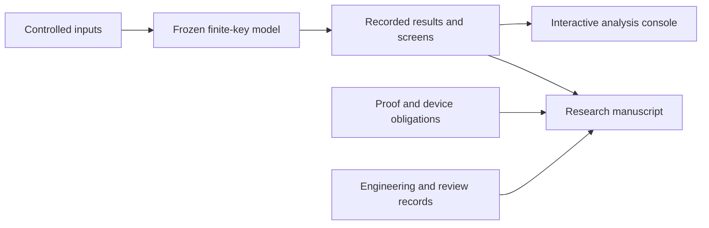

<p align="center"></p>

<p align="center">
  <a href="README.ar.md">العربية</a> ·
  <a href="docs/START_HERE.md">Start here</a> ·
  <a href="deliverables/Q-Orbit_Scientific_Manuscript_V1.0-RC3.md">Research paper</a> ·
  <a href="prototype/README.md">Analysis console</a> ·
  <a href="docs/REPRODUCIBILITY.md">Reproduce & verify</a>
</p>

## Research question

**How does a positive finite-key result change when source and detector assumptions vary—and what evidence is still needed before that result can support a device claim?**

Q-Orbit studies a satellite-to-ground quantum key distribution (QKD) concept through a frozen numerical fixture, controlled parameter screens, engineering documentation, and explicit proof-to-device obligations. The package uses an efficient BB84 weak-coherent-pulse model with signal and decoy intensities.

**Scope: theoretical and numerical research.** No physical validation, hardware deployment, security certification, or released secret key is established by this repository. Concept illustrations describe required functions, not flight-qualified hardware.

## Explore the project

| If you want to… | Open |
| :--- | :--- |
| Understand the study and its limitations | [Scientific manuscript · V1.0-RC3](deliverables/Q-Orbit_Scientific_Manuscript_V1.0-RC3.md) |
| Read a compact illustrated overview | [Illustrated research paper · PDF](research/Q-Orbit_Preliminary_Research_Paper_Illustrated_2026-08-28.pdf) |
| Browse the numerical results interactively | [Theoretical analysis console](prototype/) |
| Inspect the executable fixture and controlled inputs | [V0.16-TA1 model package](models/q-orbit-theoretical-device-imperfection-propagation-v0.16-ta1/) |
| Follow architecture, interfaces, and figures | [Engineering documentation](engineering/) |
| Trace assumptions, corrections, and review responses | [Review records](reviews/) · [Response to reviewers](deliverables/Q-Orbit_D8_Response_to_Reviewers.md) |
| Present the project | [Presentation and poster](presentations/) |
| Locate a specific source artifact | [Repository map](docs/REPOSITORY_MAP.md) |

## What the numerical record contains

| Recorded quantity | Value | Interpretation |
| :--- | ---: | :--- |
| Selected baseline half-window | 102 s | Optimum within the frozen fixture |
| Baseline signed finite-key margin | 41,338.624 bits | A theoretical margin, not a released key |
| Two-parameter screen | 41 × 41 = 1,681 points | Deterministic engineering grid |
| Positive / nonpositive grid points | 568 / 1,113 | Partition of the grid, not a success probability |
| Recorded regression checks | 12 / 12 PASS | Results in the supplied record |
| Recorded package audit checks | 20 / 20 PASS | Results in the supplied record |

Sources: [run summary](models/q-orbit-theoretical-device-imperfection-propagation-v0.16-ta1/runs/Q-Orbit_V0.16-TA1_Theoretical_Run_Summary.json), [screen data](models/q-orbit-theoretical-device-imperfection-propagation-v0.16-ta1/data_processed/Q-Orbit_V0.16-TA1_Two_Parameter_Screen.csv), and [original audit](models/q-orbit-theoretical-device-imperfection-propagation-v0.16-ta1/Q-Orbit_Theoretical_Device_Imperfection_Propagation_Final_Audit_V0.16-TA1.json). These are archived results; they are not presented as a newly executed full model run. See the [verification note](docs/REPRODUCIBILITY.md) for the checks performed during repository preparation.

## Try the analysis console

The existing console uses static HTML, CSS, JavaScript, and local CSV/JSON files.

```bash
git clone https://github.com/gaand1999/Q-Orbit-.git
cd Q-Orbit-
python3 -m http.server 8461 --bind 127.0.0.1 --directory prototype
```

Open **http://127.0.0.1:8461**. The console provides nine views: overview, finite-key analysis, window optimization, coupled screen, sensitivity, proof mapping, architecture, evidence ladder, and claim boundaries.

## How the evidence fits together



## Repository layout

```text
Q-Orbit-/
├── research/       Papers, reports, and source records
├── engineering/    Handbook chapters, interfaces, and conceptual figures
├── models/         Frozen model package and separate reference exports
├── prototype/      Static theoretical analysis console
├── reviews/        Audits, review reports, and planning records
├── presentations/  Presentation and poster files
├── deliverables/   Original delivery bundle and manuscript versions
├── exhibition/     Existing static exhibition page
├── docs/           Reading guide, provenance, and verification notes
└── assets/         Repository presentation assets
```

## Source and version discipline

Original source filenames and bytes are preserved. Distinct manuscript versions remain identifiable, and the complete frozen model keeps its internal paths and checksum manifest. Converted working intermediates, empty folders, proprietary Apple formats, and redundant ZIP copies are not part of the reading path.

Historical documents retain their original dates, restrictions, and `PRIVATE-BLOCKED` / `ZERO-RELEASED` state labels. Repository publication does not establish any new scientific validation or operational approval, and it does not silently rewrite those source records. The separately labelled private website-source bundles are excluded.

Maintained in [gaand1999/Q-Orbit-](https://github.com/gaand1999/Q-Orbit-).
