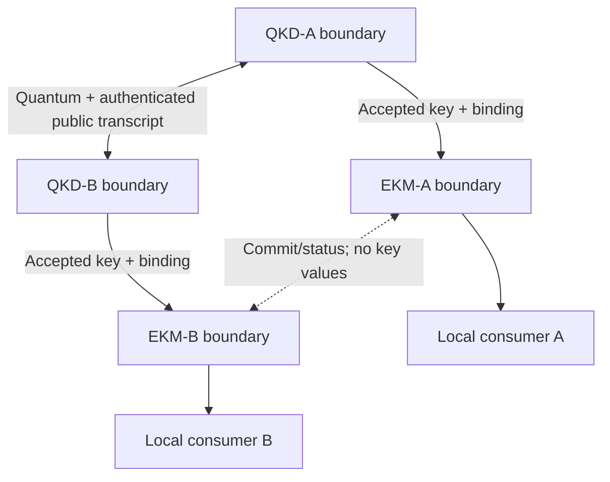

# Q-Orbit Engineering Design Handbook V0.2

## Chapter 2 — Mission & Threat Analysis

| Document field | Value |
|---|---|
| Document ID | QO-EDH-CH02 |
| Version | Correction Draft V0.2 |
| Date | 12 August 2026 |
| Parent baseline | Chapter 1 V0.2 and QO-EDH-REG-001 |
| Project phase | Preliminary research and engineering design |
| Approval status | Internally checked; awaiting Q-Orbit team approval |
| Information handling | Conceptual defensive threat information; public release requires PR-GATE-01 |

> **Document limitation.** This is a defensive, architecture-driving threat model. It is not an intelligence estimate, attack manual, vulnerability finding against an actual product, final risk assessment, penetration-test result, certification, or operational security plan. `[ED:ED-011]`

---

## 2.1 Purpose and threat-model rule

This chapter identifies protected outcomes, assets, per-endpoint boundaries, threat sources, capabilities, conditions, threat events, intended control allocations, known limitations, and candidate verification obligations for the Chapter 1 direct-link topology. `[ED:ED-011]`

The quantum channel, classical transport, exposed control interfaces, and external decision-data paths are treated as potentially observable, delayed, replayed, manipulated, spoofed, or denied. `[ED:ED-011]`

Trust is granted only to a defined entity, role, configuration, boundary, and current state after the required evidence is checked. `[ED:ED-011]`

An authenticated source may still be faulty; authenticity does not establish correctness. `[ED:ED-012]`

Final risk ratings are not assigned because deployment-specific likelihood, mission impact, tested control effectiveness, and risk authority are not available. `[ED:ED-011]`

NIST SP 800-30 distinguishes threat sources, events, vulnerabilities, likelihood, impact, and risk. `[V:CE-026]`

V0.2 uses consequence and design-priority labels only; they are not likelihood or risk scores. `[ED:ED-011]`

---

## 2.2 Method and priority scales

### 2.2.1 Analysis sequence

`Mission outcome → Asset → Boundary → Threat source → Capability → Condition → Threat event → Control allocation → Known limitation → Candidate obligation → Verification evidence` `[ED:ED-011]`

### 2.2.2 Consequence labels

| Label | V0.2 meaning |
|---|---|
| C1 | Could disclose, substitute, misbind, or authorize key material; silently invalidate the security claim; compromise trusted control; or cause loss of a stakeholder-defined critical service. |
| C2 | Could deny or materially degrade service, corrupt decision inputs, expose sensitive metadata, or enable a later C1 event. |
| C3 | Localized and recoverable effect with no demonstrated key compromise or lasting mission loss. |

Consequence labels are provisional until mission impact is supplied. `[TBD:TBD-002]`

### 2.2.3 Design-priority labels

| Label | Meaning |
|---|---|
| P1 | Directly changes the August reference architecture, state logic, or mandatory negative cases. |
| P2 | Must be represented and allocated now but requires specialist or architecture closure after the core baseline. |
| P3 | Recorded for future topology or monitoring and cannot expand the August baseline. |

The P1 set is intentionally limited to design drivers rather than assigning nearly every threat the same priority. `[ED:ED-011]`

---

## 2.3 Protected outcomes and unacceptable outcomes

### 2.3.1 Protected outcomes

The primary protected outcome is two-sided replenishment of matching, policy-valid key inventory at EKM-A and EKM-B after all profile, device, authentication, and policy gates pass. `[ED:ED-005]`

The secondary protected outcome is a separate, correctly bound transaction to the two local representative consumers. `[ED:ED-004]`

### 2.3.2 Unacceptable outcomes

| ID | Unacceptable outcome | Consequence | Control |
|---|---|---|---|
| UO-01 | An unauthorized entity learns raw, intermediate, final, stored, delivered, or consumed key material. | C1 | `[ED:ED-011]` |
| UO-02 | The endpoints accept attacker-influenced, mismatched, or model-invalid output as an approved key. | C1 | `[ED:ED-011]` |
| UO-03 | One EKM marks inventory available while the peer is uncommitted, unknown, or contradictory. | C1 | `[ED:ED-013]` |
| UO-04 | A key is bound to the wrong endpoint, request, purpose, policy, consumer, or lifecycle state. | C1 | `[ED:ED-011]` |
| UO-05 | Key release occurs after authentication, device, finite-key, configuration, or policy failure. | C1 | `[ED:ED-009]` |
| UO-06 | AQMO or an operator overrides a local security abort or invents a qualified configuration. | C1 | `[ED:ED-010]` |
| UO-07 | A failed QKD service silently falls back to a different security service or trust path. | C1 | `[ED:ED-009]` |
| UO-08 | A key is reused, rolled back, retained beyond policy, incompletely destroyed, or used after revocation. | C1 | `[ED:ED-011]` |
| UO-09 | Space, ground, EKM, identity, AQMO, software, or administrative compromise controls security-critical behavior. | C1 | `[ED:ED-011]` |
| UO-10 | Stale, conflicting, or faulty decision data is treated as trustworthy merely because it is signed. | C1/C2 | `[ED:ED-012]` |
| UO-11 | A required service is denied or inventory is exhausted. | C1/C2 | `[TBD:TBD-002]` |
| UO-12 | A public artifact implies approval, exposes sensitive details, or overstates model/security evidence. | C2 | `[ED:ED-015]` |

---

## 2.4 Asset register

| ID | Asset | Required protection | Primary boundary |
|---|---|---|---|
| A-01 | Protected mission data | External secure-application confidentiality, integrity, authenticity, and availability | Local consumers and external classical communications |
| A-02 | Final and stored key values | Confidentiality, integrity, peer agreement, authorization, lifecycle control | QKD-A/QKD-B and EKM-A/EKM-B |
| A-03 | Local secret intermediate strings | Confidentiality, integrity, minimal retention, controlled destruction | Each QKD endpoint boundary separately |
| A-04 | Public/authenticated QKD protocol transcript | Integrity, origin authentication, freshness, session binding, leakage accounting | Classical protocol channel and both endpoints |
| A-05 | Authentication and trust material | Confidentiality where applicable, integrity, lifecycle, revocation, recovery | Identity and endpoint trust boundaries |
| A-06 | Key identifiers and binding metadata | Integrity, uniqueness, anti-replay, correct endpoint/purpose/policy/lifecycle binding | EKM-A/EKM-B and local consumer interfaces |
| A-07 | Source, detector, entropy, calibration, and health state | Integrity, provenance, freshness, bounded operating envelope | QKD-A and QKD-B separately |
| A-08 | EKM state and policy | Isolation, consistency, authorization, audit, recovery | EKM-A and EKM-B separately |
| A-09 | AQMO policy, configuration, plan, and decision state | Integrity, availability, least privilege, auditability | AQMO/control boundary |
| A-10 | Spacecraft/payload command, telemetry, time, and configuration | Authenticity, authorization, freshness, integrity, safe recovery | Platform and space endpoint boundary |
| A-11 | Orbit, environment, time, resource, and inventory metadata | Provenance, integrity, freshness, validity, uncertainty/quality | External data and control boundaries |
| A-12 | Software, firmware, models, build artifacts, and configuration | Integrity, authenticity, version control, rollback control, reproducibility | Development/supply chain and all runtime boundaries |
| A-13 | Audit and incident evidence | Integrity, origin, consistent time, controlled disclosure, custody | All components to evidence repository |
| A-14 | Physical infrastructure, maintainers, administrators, and procedures | Controlled access, separation of duties, accountability, safe maintenance | Ground/operations and lifecycle boundaries |
| A-15 | Service availability and inventory sufficiency | Predictable degradation, reservation, recovery, no silent compromise | End-to-end service |
| A-16 | Public project claims and releasable artifacts | Accuracy, source traceability, approval discipline, sensitive-detail control | PR-GATE-01 |

The asset selection is a Q-Orbit modeling decision. `[ED:ED-011]`

ETSI QKD 016 V2.1.1 covers a pair of prepare-and-measure modules and includes security treatment of QKD service data, authenticated classical channels, access control, audit, self-test, and secure states. `[V:CE-011]`

Its scope does not validate the wider Q-Orbit system. `[ED:ED-011]`

---

## 2.5 Per-endpoint boundaries and allowed data flows

### 2.5.1 Boundary view

QKD-A and QKD-B are separate security boundaries; there is no single pair-wide memory boundary. `[ED:ED-003]`

EKM-A and EKM-B are separate logical key-management boundaries. `[ED:ED-005]`

Physical ownership and HSM placement remain open. `[TBD:TBD-008]`

### 2.5.2 Key and transcript classification

| Data class | May cross between QKD endpoints? | May enter AQMO? | Rule |
|---|---:|---:|---|
| Local raw detections and local raw-key strings | No direct export as secret strings | No | Remain inside the local endpoint; minimize retention. |
| Sifted/reconciled secret intermediate strings | No direct export as secret strings | No | Protect and destroy under the selected protocol design. |
| Required protocol announcements | Yes | Status only if needed | Basis/decoy disclosures, synchronization data, parameter-estimation samples, reconciliation messages, verification data, and session control may be exchanged when the selected protocol permits. |
| Error-correction leakage and public transcript | Yes | Aggregated status only | Authenticate, bind to the session, and account for disclosed information in the finite-key calculation. |
| Accepted final key | No endpoint-to-endpoint file transfer is implied | No | Each endpoint exports locally only to its associated EKM through a protected path after acceptance. |
| Key ID, commit state, and binding metadata | Yes, under protected control semantics | Minimum aggregated metadata only | No key value may be derivable from the identifier or status. |

The exact transcript fields and leakage treatment are profile-specific. `[TBD:TBD-005]`

AQMO has no key-value interface. `[ED:ED-010]`

### 2.5.3 Trust-boundary register

| ID | Crossing | Security rule | Open detail |
|---|---|---|---|
| TB-01 | QKD-A ↔ quantum path | Treat as adversary-accessible; accept only through the selected proof/device gates. | `[TBD:TBD-006]` |
| TB-02 | QKD-B ↔ quantum path | Same rule; enforce receiver operating envelope and optical monitoring. | `[TBD:TBD-006]` |
| TB-03 | QKD-A ↔ QKD-B classical protocol | Authenticate origin/integrity, bind session, enforce freshness/anti-replay, and account for leakage. | `[TBD:TBD-007]` |
| TB-04 | QKD-A ↔ EKM-A | Protected local handoff; no export before endpoint acceptance. | `[TBD:TBD-008]` |
| TB-05 | QKD-B ↔ EKM-B | Protected local handoff; no export before endpoint acceptance. | `[TBD:TBD-008]` |
| TB-06 | EKM-A ↔ EKM-B | Protected state coordination; ambiguous state is not available inventory. | `[TBD:TBD-009]` |
| TB-07 | EKM-A/B ↔ local consumers | Authenticate/authorize; validate binding, state, purpose, and both-sided acknowledgement. | `[TBD:TBD-010]` |
| TB-08 | AQMO ↔ endpoints/EKMs/operations | Mutual identity, integrity, authorization, freshness, bounded commands, no keys. | `[TBD:TBD-011]` |
| TB-09 | External data ↔ AQMO/operations | Authenticate where applicable; validate correctness indicators, freshness, plausibility, and conflict state. | `[TBD:TBD-012]` |
| TB-10 | Platform ↔ QKD-A | Authenticate/authorize commands; verify configuration, time, and telemetry provenance. | `[TBD:TBD-008]` |
| TB-11 | Operators/maintainers ↔ administration | Individual identity, least privilege, separation of duties, controlled sessions, full audit. | `[TBD:TBD-019]` |
| TB-12 | Development/supply chain ↔ operational baseline | Provenance, protected release, acceptance test, signing, inventory, vulnerability response. | `[TBD:TBD-015]` |
| TB-13 | Controlled artifacts ↔ public website | PR-GATE-01 before release. | `[TBD:TBD-020]` |

---

## 2.6 Threat sources, capabilities, and conditions

### 2.6.1 Threat-source classes

| ID | Source class |
|---|---|
| TS-01 | External cyber adversary |
| TS-02 | Quantum/optical-channel adversary |
| TS-03 | RF/optical denial actor |
| TS-04 | Malicious, coerced, or careless insider |
| TS-05 | Supply-chain adversary |
| TS-06 | Accidental operator/developer action |
| TS-07 | Hardware/software/clock/storage failure |
| TS-08 | Environmental condition or site outage |
| TS-09 | Future quantum-capable cryptanalytic adversary |

### 2.6.2 Capability classes

| ID | Capability abstraction |
|---|---|
| CAP-1 | Reach a connected classical interface remotely |
| CAP-2 | Use a stolen, compromised, or misauthorized identity/session |
| CAP-3 | Observe, inject, interfere with, or deny an RF/optical path |
| CAP-4 | Reach local physical equipment, cable, port, or maintenance interface |
| CAP-5 | Exercise privileged operational, administrative, developer, or calibration access |
| CAP-6 | Modify components or artifacts before acceptance or during maintenance |
| CAP-7 | Use a cryptographically relevant quantum computer against vulnerable cryptography or retained ciphertext |

These abstractions do not assert that any named adversary has the capability. `[ED:ED-011]`

### 2.6.3 Condition/weakness classes

| ID | Condition or weakness |
|---|---|
| CW-01 | Unauthenticated, weakly authenticated, stale, replayable, or misbound protocol/control traffic |
| CW-02 | Protocol security proof or finite-key calculation does not match the configured implementation |
| CW-03 | Source emissions, intensities, phase, modulation, or leakage deviate from the model |
| CW-04 | Detector efficiency, timing, saturation, or response deviates from the model |
| CW-05 | Optical isolation, filtering, monitoring, or injected-light limits are insufficient |
| CW-06 | Entropy, calibration, device health, time, or operating-envelope state is faulty or manipulable |
| CW-07 | Software, firmware, build, configuration, or update integrity is weak |
| CW-08 | Identity, role, key binding, lifecycle, or distributed state is ambiguous or incorrect |
| CW-09 | Segmentation, least privilege, physical protection, or administrative control is weak |
| CW-10 | External decision data lacks freshness, validity, independence, plausibility, or conflict handling |
| CW-11 | Resource/inventory limits permit exhaustion, monopolization, or forced abort |
| CW-12 | Release and communication wording lacks evidence/authority controls |

---

## 2.7 Evidence for implementation-specific threat classes

Published work has demonstrated time-shift attacks exploiting detector-efficiency mismatch. `[V:CE-018]`

Published work has demonstrated detector control by tailored bright illumination against commercial QKD systems. `[V:CE-019]`

Published work has demonstrated injected-light/back-reflection Trojan-horse risk. `[V:CE-020]`

These papers establish attack classes; they do not establish that a future Q-Orbit device contains the same weakness. `[ED:ED-011]`

Decoy-state methods address multiphoton weak-coherent-pulse risk under their stated assumptions. `[V:CE-021]`

Q-Orbit therefore does not use the cited decoy-state result to claim removal of every source imperfection or side channel. `[ED:ED-011]`

MDI-QKD is designed to remove detector side channels under its architecture. `[V:CE-022]`

The cited source supports a detector-side-channel claim only. `[V:CE-022]`

Q-Orbit therefore does not treat MDI-QKD as evidence that source, endpoint, or every implementation risk is removed, and MDI-QKD is not the V0.2 reference profile. `[ED:ED-006]`

---

## 2.8 Threat register

Each row links a source, capability, condition, boundary/asset, and adverse effect. Inclusion and priority are Q-Orbit design decisions. `[ED:ED-011]`

| ID | Threat event | TS / CAP / condition | Boundary and assets | Effect | Priority |
|---|---|---|---|---|---|
| QO-T01 | Channel observation/manipulation yields adversary information beyond the bound accepted by the selected proof. | TS-02 / CAP-3 / CW-02 | TB-01/02; A-02–A-04 | Silent invalid key or safe abort | P1 |
| QO-T02 | Source multiphoton behavior, intensity/phase error, modulation leakage, or incorrect decoy implementation is absent from the model. | TS-02, TS-07 / CAP-3, CAP-5 / CW-03 | TB-01; A-02, A-03, A-07 | C1 | P1 |
| QO-T03 | Detector control, efficiency mismatch, timing, saturation, or response invalidates the receiver model. | TS-02 / CAP-3 / CW-04 | TB-02; A-02, A-03, A-07 | C1 | P1 |
| QO-T04 | Injected probes or back-reflections expose internal settings or state. | TS-02 / CAP-3 / CW-05 | TB-01/02; A-03, A-07 | C1 | P2 |
| QO-T05 | Predictable, biased, failed, or manipulated entropy affects security-critical choices or keys. | TS-04, TS-05, TS-07 / CAP-5, CAP-6 / CW-06 | Endpoint boundaries; A-02, A-03, A-05, A-07 | C1 | P2 |
| QO-T06 | Calibration drift, environmental stress, malfunction, or malicious calibration is not detected before acceptance. | TS-04, TS-07, TS-08 / CAP-5 / CW-06 | QKD-A/B; A-02, A-07 | C1 | P1 |
| QO-T07 | Bright light, background, or acquisition deception causes abnormal counts, false acquisition, sensor stress, or denial. | TS-02, TS-03, TS-08 / CAP-3 / CW-05, CW-11 | TB-01/02; A-07, A-15 | C1 if unsafe acceptance; otherwise C2 | P2 |
| CP-T01 | Peer impersonation or altered classical protocol traffic succeeds because authentication/trust is absent, compromised, or downgraded. | TS-01, TS-02 / CAP-1, CAP-2, CAP-3 / CW-01 | TB-03; A-02–A-05 | C1 | P1 |
| CP-T02 | Replay, session hijack, or cross-session substitution binds valid material to the wrong session. | TS-01 / CAP-1, CAP-2 / CW-01, CW-08 | TB-03/06/07; A-02, A-04, A-06 | C1 | P2 |
| CP-T03 | Compromised/defective post-processing changes estimation, reconciliation, leakage, privacy amplification, verification, or abort logic. | TS-01, TS-04, TS-05, TS-07 / CAP-1, CAP-5, CAP-6 / CW-02, CW-07 | QKD-A/B; A-02–A-04, A-12 | C1 | P1 |
| CP-T04 | Manipulated time, synchronization, ordering, or ephemeris corrupts coincidence, freshness, plan, or audit state. | TS-01, TS-07 / CAP-1, CAP-2, CAP-5 / CW-01, CW-10 | TB-03/09/10; A-04, A-10, A-11, A-13 | C1/C2 | P2 |
| CP-T05 | Failure triggers an unapproved algorithm, key source, trust path, endpoint, or policy downgrade. | TS-01, TS-04, TS-06 / CAP-2, CAP-5 / CW-08 | Control/KMS; A-01, A-05, A-15 | C1 | P2 |
| KM-T01 | EKM, trusted path, or local consumer boundary is compromised after QKD acceptance. | TS-01, TS-04 / CAP-1, CAP-2, CAP-4, CAP-5 / CW-09 | TB-04–07; A-02, A-05, A-06, A-08 | C1 | P1 |
| KM-T02 | Valid key material is misbound or delivered to an unauthorized/wrong endpoint, purpose, policy, session, or consumer. | TS-01, TS-04, TS-06 / CAP-2, CAP-5 / CW-08 | TB-06/07; A-02, A-06, A-08 | C1 | P1 |
| KM-T03 | Key material is reused, rolled back, over-retained, incompletely destroyed, or used after revocation. | TS-04, TS-06, TS-07 / CAP-5 / CW-08 | EKM/consumer; A-02, A-06, A-08 | C1 | P2 |
| KM-T04 | Metadata or audit leaks mission patterns or is altered to conceal misuse. | TS-01, TS-04 / CAP-1, CAP-2, CAP-5 / CW-09 | TB-06/08/11; A-06, A-13 | C2, possibly enabling C1 | P3 |
| CY-T01 | Ground endpoint, EKM-B, operations, or network compromise enables persistence, control, credential theft, or lateral movement. | TS-01 / CAP-1, CAP-2 / CW-07, CW-09 | TB-05/08/11; A-02, A-05–A-13 | C1 | P1 |
| CY-T02 | Spacecraft bus or payload compromise changes QKD operation, time, configuration, software, or reported state. | TS-01 / CAP-1, CAP-2 / CW-07, CW-09 | TB-10; A-07, A-09–A-12 | C1 | P2 |
| CY-T03 | Malicious/vulnerable hardware, firmware, software, dependency, model, update, or calibration equipment enters through supply chain/maintenance. | TS-05 / CAP-6 / CW-07, CW-09 | TB-12; A-07, A-09, A-10, A-12 | C1 | P2 |
| CY-T04 | A privileged insider exports sensitive data, alters policy/calibration, combines roles, or suppresses evidence. | TS-04 / CAP-4, CAP-5 / CW-09 | TB-11/12; A-02–A-14 | C1 | P2 |
| AQ-T01 | False, stale, conflicting, or faulty orbit, weather, time, hardware, security, or inventory data creates an unsafe/invalid plan. | TS-01, TS-04, TS-07, TS-08 / CAP-1, CAP-2, CAP-5 / CW-10 | TB-08/09; A-09–A-11, A-15 | C1/C2 | P1 |
| AQ-T02 | AQMO/control identity, commands, configuration, or policy is spoofed, altered, replayed, or denied. | TS-01 / CAP-1, CAP-2 / CW-01, CW-07 | TB-08; A-09, A-11–A-13 | C1/C2 | P2 |
| AQ-T03 | Optimization defect, unsafe autonomy, or configuration error selects incompatible resources or bypasses a hard constraint. | TS-06, TS-07 / CAP-5 / CW-07, CW-10 | AQMO; A-09, A-11, A-12, A-15 | C1 | P2 |
| AV-T01 | Optical/RF interference, traffic flooding, protocol abuse, or repeated forced aborts consume the opportunity or authentication/key inventory. | TS-03, TS-01 / CAP-1, CAP-3 / CW-11 | TB-01–03/08; A-05, A-07, A-15 | C1/C2 | P1 |
| AV-T02 | Weather, turbulence, background, pointing, radiation, thermal state, hardware failure, or site outage removes the opportunity. | TS-07, TS-08 / none required / CW-06, CW-11 | Space/ground; A-07, A-10, A-11, A-15 | C1/C2 | P2 |
| AV-T03 | Key, authentication, power, storage, detector, compute, or contact resources are exhausted or monopolized. | TS-01, TS-03, TS-07 / CAP-1, CAP-3 / CW-11 | EKM/AQMO/endpoints; A-05, A-08, A-09, A-15 | C1/C2 | P2 |
| TN-T01 | A future relay with plaintext-key access is compromised and becomes the hidden basis of an end-to-end claim. | TS-01, TS-04 / CAP-1, CAP-4, CAP-5 / CW-09 | Future boundary; A-02, A-08, A-14 | C1 | P3 |
| CR-T01 | Future quantum capability threatens vulnerable legacy cryptography/retained ciphertext, or crypto migration creates unsafe downgrade/configuration state. | TS-09, TS-06 / CAP-7, CAP-5 / CW-07, CW-08 | Identity/software/mission data; A-01, A-05, A-12 | C1/C2 | P2 |

The eleven P1 rows are the August design drivers. `[ED:ED-011]`

Threat priority is not a claim that a P2/P3 event is unimportant or accepted. `[ED:ED-011]`

---

## 2.9 Intended control families

These are allocations for requirements and architecture; they are not implemented controls or effectiveness claims. `[ED:ED-011]`

| ID | Control family | Intended content |
|---|---|---|
| CF-01 | Identity/authentication/authorization | Trust anchors, mutual identity, role/purpose authorization, credential lifecycle |
| CF-02 | Protocol and finite-key assurance | Profile/configuration, authenticated transcript, estimation, leakage, privacy amplification, failure budgets, abort |
| CF-03 | Optical implementation security | Source/detector characterization, isolation, filtering, monitoring, injected-light and side-channel evaluation |
| CF-04 | Entropy/calibration/health | Entropy model, health tests, protected calibration, drift/operating limits, failure state |
| CF-05 | Segmentation and least privilege | Separate QKD, platform, EKM, AQMO, external-service, consumer, and admin functions |
| CF-06 | Key lifecycle and boundary | Local handoff, storage, labeling, reservation, delivery, use, revocation, destruction, plaintext minimization |
| CF-07 | Session/binding/commit safety | Unique IDs, anti-replay, endpoint/purpose binding, prepared/committed/unknown state, idempotency, quarantine |
| CF-08 | Secure software/configuration/update | Protected build/release, integrity, version control, rollback, vulnerability and recovery process |
| CF-09 | Constrained AQMO and data validation | Hard constraints, provenance/freshness/validity, conflict handling, human gates, no-key interface |
| CF-10 | Availability/inventory/degradation | Reservation, rate limiting, thresholds, qualified replanning, explicit no-service, no silent downgrade |
| CF-11 | Monitoring/audit/incident/recovery | Tamper-evident evidence, state telemetry, containment, revocation, known-good recovery |
| CF-12 | Physical/personnel/maintenance | Controlled zones, ports, sessions, separation of duties, calibration custody, safe maintenance |
| CF-13 | Supply-chain/lifecycle assurance | Provenance, component/software inventory, acceptance, signing, vulnerability response, sanitization |
| CF-14 | Crypto agility and fallback governance | Algorithm/protocol inventory, deprecation, controlled migration, explicitly authorized separate fallback |
| CF-15 | Independent assurance | Proof-to-device map, code/model review, adversarial optical/cyber testing, fault injection, V&V traceability |
| CF-16 | Public-release control | Claim/source check, sensitive-detail review, authority disposition, consistent website derivation |

NIST CSF 2.0 includes Govern, Identify, Protect, Detect, Respond, and Recover outcomes. `[V:CE-027]`

Q-Orbit uses those functions to avoid a prevention-only control model. `[ED:ED-011]`

NIST standardized ML-KEM and ML-DSA. `[V:CE-023]`

Algorithm/parameter/assurance approval and errata disposition remain open. `[TBD:TBD-007]`

---

## 2.10 Threat-to-control and limitation matrix

The last column is titled **known dependency/limitation**, not residual risk, because no control has yet been implemented or tested. `[ED:ED-011]`

| Threat | Intended control families | Mandatory safe response | Known dependency/limitation |
|---|---|---|---|
| QO-T01 | CF-02/03/15 | Reject or derive only within the selected bound | Proof/model applicability remains TBD-005/006 |
| QO-T02 | CF-02/03/04/15 | Abort; quarantine configuration/device | Source model remains TBD-006 |
| QO-T03 | CF-03/04/15 | Abort; isolate receiver configuration | Detector-specific attack coverage remains TBD-006 |
| QO-T04 | CF-03/12/15 | Abort; inspect/recalibrate | Low-observable/out-of-band leakage remains test-dependent |
| QO-T05 | CF-04/13/15 | Enter failure state; invalidate affected sessions | Entropy model remains TBD-006 |
| QO-T06 | CF-04/12/15 | Fail closed; controlled recalibration | Latent/common-mode failure remains possible |
| QO-T07 | CF-03/04/10 | Abort/safe sensor state/replan | Availability cannot be guaranteed |
| CP-T01 | CF-01/02/14 | Reject/abort; revoke or recover trust | Initial provisioning remains TBD-007 |
| CP-T02 | CF-01/07 | Reject; close; investigate | Distributed synchronization remains TBD-009 |
| CP-T03 | CF-02/05/08/15 | Invalidate output; restore approved build/config | Undiscovered defects remain possible |
| CP-T04 | CF-01/07/09 | Hold/abort/replan; distrust source | Source/conflict policy remains TBD-012 |
| CP-T05 | CF-10/14 | Deny service or use only separately authorized fallback | Mission availability may be lost |
| KM-T01 | CF-05/06/11/12/15 | Stop release; revoke/zeroize/isolate | Privileged/hardware compromise remains test-dependent |
| KM-T02 | CF-01/06/07 | Deny, quarantine, revoke | Identity governance remains TBD-010 |
| KM-T03 | CF-06/07/11 | Revoke/destroy; assess use | Consumer enforcement remains TBD-010 |
| KM-T04 | CF-05/11/16 | Preserve/restore evidence; restrict disclosure | Traffic analysis cannot be eliminated by logging policy alone |
| CY-T01 | CF-01/05/08/11/12/15 | Isolate/revoke/recover known-good | Zero-day/persistence remains possible |
| CY-T02 | CF-01/05/08/11 | Safe payload state; revoke command path | Platform recovery remains TBD-008 |
| CY-T03 | CF-08/13/15 | Quarantine/replace/revoke signing trust | Deep supplier compromise remains possible |
| CY-T04 | CF-01/05/11/12 | Suspend access; investigate; recover | Collusion/coercion remains possible |
| AQ-T01 | CF-09/11/15 | Reject input; hold/abort | Correlated faulty sources remain TBD-012 |
| AQ-T02 | CF-01/05/09/11 | Reject/isolate controller; local safe policy | Control-plane denial remains possible |
| AQ-T03 | CF-09/15 | Stop automation; restore approved plan | Objective interactions require testing |
| AV-T01 | CF-05/10/11 | Abort/replan; preserve inventory | Opportunity may still be lost |
| AV-T02 | CF-04/10/12 | Abort/defer/maintain | Weather/orbital intermittency remain |
| AV-T03 | CF-09/10 | Throttle/prioritize/replenish | Demand may exceed physical supply |
| TN-T01 | CF-01/05/06/12/15 | Do not baseline relay without separate approval | Plaintext relay remains a trust dependency |
| CR-T01 | CF-08/13/14 | Controlled migration; no downgrade | Future cryptanalysis/approval changes remain |

No row is called mitigated until allocation, implementation, test evidence, and risk disposition exist. `[ED:ED-011]`

---

## 2.11 Design-driving scenarios

### DS-01 — Finite-key/profile gate fails

Counts, decoy statistics, QBER, yields, phase-error bound, leakage, security parameters, or device state violate the reference acceptance suite. `[ED:ED-009]`

The session produces no approved key; affected intermediate material is destroyed or quarantined; AQMO receives only a non-secret reason/status. `[ED:ED-009]`

The exact acceptance suite remains TBD-005/006. `[TBD:TBD-005]` `[TBD:TBD-006]`

### DS-02 — Classical authentication fails

No accepted key is released and trust is not regenerated over the failed uncontrolled path. `[ED:ED-009]`

Recovery uses the future approved provisioning/recovery process. `[TBD:TBD-007]`

### DS-03 — Partial or ambiguous EKM commit

If either EKM is prepared, committed, timed out, or unknown without matching positive peer evidence, neither side marks the key available. `[ED:ED-013]`

The transaction enters reconciliation/quarantine; retry may query idempotent state but may not create a second allocation. `[ED:ED-013]`

Detailed protocol and timeouts remain TBD-009. `[TBD:TBD-009]`

### DS-04 — Correct key, wrong consumer/binding

Any absent, stale, revoked, contradictory, or unauthorized endpoint/purpose/policy/key-state field denies delivery. `[ED:ED-009]`

Affected allocation is quarantined or revoked. `[ED:ED-013]`

### DS-05 — AQMO receives conflicting signed data

AQMO records the conflict and holds or aborts; it does not select a preferred value without a predeclared conflict rule. `[ED:ED-012]`

Source redundancy and authoritative-resolution rules remain TBD-012. `[TBD:TBD-012]`

### DS-06 — AQMO is lost during a valid session

Local endpoint safety, authentication, device, profile, and abort gates remain active. `[ED:ED-010]`

Continuation is permitted only under a still-valid preauthorized plan; otherwise the session holds or aborts. `[ED:ED-010]`

### DS-07 — Endpoint/EKM compromise suspected

New key release from the affected domain stops; identities are revoked or suspended; evidence is preserved without logging keys; return to service requires known-good restoration and explicit authority. `[ED:ED-009]`

The authority and evidence package remain TBD-015/019. `[TBD:TBD-015]` `[TBD:TBD-019]`

### DS-08 — Public website content fails release review

The page or artifact remains unpublished until claims, operational detail, model limitations, and authority disposition pass PR-GATE-01. `[ED:ED-015]`

---

## 2.12 Security-claim boundary

Published evidence records a satellite-to-ground QKD demonstration and an integrated space-to-ground network demonstration. `[V:CE-003]` `[V:CE-004]`

Q-Orbit may describe those results only with their experiment-specific conditions and applicability limits. `[ED:ED-015]`

The 4,600 km result must always carry its trusted-relay qualification. `[ED:ED-015]`

Q-Orbit may state that its reference model evaluates a stated downlink finite-block efficient-BB84 profile under stated assumptions. `[ED:ED-007]`

Q-Orbit may not state that:

- real-world eavesdropping is always detected;
- low QBER alone proves security;
- QKD prevents endpoint compromise, malware, insider action, supply-chain compromise, or denial of service;
- positive secret-key length proves implementation or system security;
- MDI-QKD or decoy states remove every implementation risk;
- AQMO is an AI security authority;
- a remote consumer or trusted relay is included in the direct-link baseline; or
- the project is certified, deployed, adopted, or approved. `[ED:ED-015]`

The current NSA position for NSS must be displayed if that jurisdiction/customer becomes applicable. `[ED:ED-015]`

Whether it applies remains TBD-001. `[TBD:TBD-001]`

---

## 2.13 Candidate security obligations — not baselined requirements

These statements are inputs to Chapter 4. They deliberately avoid `shall` and require explicit disposition. `[ED:ED-016]`

| ID | Atomic candidate obligation | Acceptance evidence |
|---|---|---|
| SEC-OBL-001 | Authenticate each QKD peer for the active session before final-key acceptance. | Negative peer-identity test |
| SEC-OBL-002 | Integrity-protect and session-bind every security-relevant classical protocol message. | Replay/substitution test |
| SEC-OBL-003 | Reject final-key acceptance when any profile-specific finite-key condition fails. | Fault-injected calculation test |
| SEC-OBL-004 | Reject final-key acceptance when required device health/calibration state is invalid or unknown. | Device-state fault test |
| SEC-OBL-005 | Prevent AQMO from receiving any key value. | Data-flow/interface inspection |
| SEC-OBL-006 | Prevent AQMO from overriding endpoint abort or acceptance state. | Authority/command negative test |
| SEC-OBL-007 | Filter all hard-constraint violations before AQMO ranking. | Constraint/replay test |
| SEC-OBL-008 | Attach source, time, validity, provenance, and quality state to each decision-critical input. | Schema inspection |
| SEC-OBL-009 | Hold or abort when decision-critical sources conflict without a resolved policy rule. | Conflict injection test |
| SEC-OBL-010 | Bind each accepted key to unique key ID, endpoint pair, session, purpose, policy, validity, and lifecycle state. | Trace and negative binding test |
| SEC-OBL-011 | Mark key inventory available only after positive two-sided commit evidence. | Partial commit test |
| SEC-OBL-012 | Make commit/status processing idempotent for a repeated correlation/key identifier. | Duplicate-message test |
| SEC-OBL-013 | Quarantine key material whose commit or peer state is ambiguous. | Timeout/partition test |
| SEC-OBL-014 | Authorize each local consumer and verify both-sided delivery binding before delivery success. | Wrong-consumer/one-sided test |
| SEC-OBL-015 | Prevent reuse after reservation policy, delivery, consumption, expiry, revocation, or destruction transition. | Key-state-machine test |
| SEC-OBL-016 | Protect source/detector optical assumptions with characterization and adversarial evaluation. | Proof-to-device report and test |
| SEC-OBL-017 | Protect entropy and calibration state with defined health and integrity evidence. | Entropy/calibration dossier |
| SEC-OBL-018 | Authenticate and authorize platform, endpoint, EKM, AQMO, and administrative commands. | Interface negative tests |
| SEC-OBL-019 | Verify runtime software, firmware, model, and configuration against an approved version before activation. | Build/update/rollback test |
| SEC-OBL-020 | Separate QKD, platform, EKM, AQMO, external, consumer, and administration privileges/flows. | Architecture review and access tests |
| SEC-OBL-021 | Record tamper-evident non-secret audit evidence for authentication, configuration, profile, EKM state, AQMO decisions, aborts, and administration. | Log-content/integrity/replay test |
| SEC-OBL-022 | Enter an incident state that prevents new release from an affected trust domain. | Incident scenario |
| SEC-OBL-023 | Require known-good restoration, revalidation, trust re-establishment, and explicit authority before return to service. | Recovery exercise |
| SEC-OBL-024 | Prevent automatic change to a different algorithm, key source, endpoint, trust path, or security label after failure. | Downgrade test |
| SEC-OBL-025 | Keep a trusted relay outside the baseline until a separate trust/risk decision is approved. | Architecture/configuration inspection |
| SEC-OBL-026 | Track source currency, corrigenda, planning notes, and errata at every baseline. | Source-currency review |
| SEC-OBL-027 | Independently map the selected proof assumptions to hardware, software, interfaces, and operating conditions. | Independent assurance report |
| SEC-OBL-028 | Block public release until PR-GATE-01 is positively dispositioned. | Release record |

---

## 2.14 Verification evidence packages

| Package | Required purpose | Open issue |
|---|---|---|
| Protocol dossier | Exact protocol, attacker model, finite-key equations, failure budgets, leakage, block rules, accept/no-key conditions | `[TBD:TBD-005]` |
| Device assumption map | Source, detector, optics, entropy, calibration, timing, health, side-channel assumptions | `[TBD:TBD-006]` |
| Authentication/trust dossier | Provisioning, authentication, refresh, revocation, recovery, anti-replay, session binding | `[TBD:TBD-007]` |
| Boundary and EKM design | Per-module boundaries, entry/exit data, prepared/committed/unknown protocol, idempotency, quarantine | `[TBD:TBD-008]` `[TBD:TBD-009]` |
| Consumer lifecycle test | Identity, binding, reservation, delivery, acknowledgement, consumption, revocation, destruction | `[TBD:TBD-010]` |
| AQMO/data test | Hard constraints, no-key interface, stale/conflicting input, loss of control, decision replay | `[TBD:TBD-011]` `[TBD:TBD-012]` |
| Independent security test plan | Optical, cyber, software, fault, and key-management evaluation | `[TBD:TBD-015]` |
| Audit/incident dossier | Audit schema, time, custody, retention, privacy, containment, recovery | `[TBD:TBD-019]` |
| Public-release record | PR-GATE-01 result for each public artifact | `[TBD:TBD-020]` |

The August package can define these packages and demonstrate selected model/state tests. It cannot claim completion of hardware security testing that has not occurred. `[ED:ED-014]`

---

## 2.15 Review Gate CH2-G1-V0.2

Chapter 2 is ready for Q-Orbit team baseline approval when the team accepts:

1. the direct-link assets and per-endpoint boundaries;
2. the permitted protocol transcript versus non-exportable secret intermediate distinction;
3. the source/capability/condition links in all 28 threat events;
4. the eleven P1 design drivers and absence of quantitative likelihood/risk claims;
5. the prepared/committed/unknown safe-state principle;
6. the replacement of “residual risk” with unverified dependencies/limitations;
7. the profile-specific implementation attack qualifiers;
8. the 28 candidate obligations as non-normative Chapter 4 inputs; and
9. PR-GATE-01 as part of the threat/control model.

Approval means acceptance of a preliminary defensive model, not acceptance of operational risk or certification of any control. `[ED:ED-011]`
