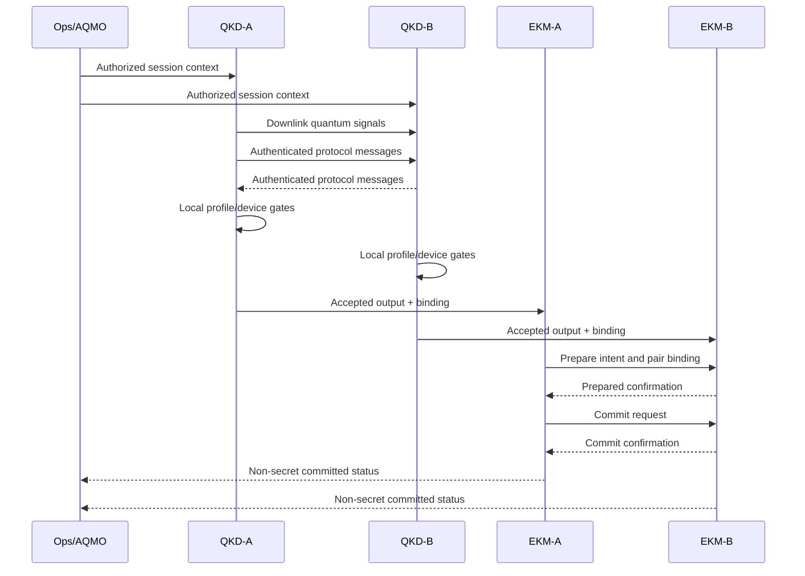
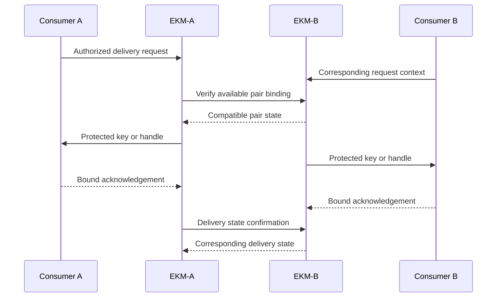
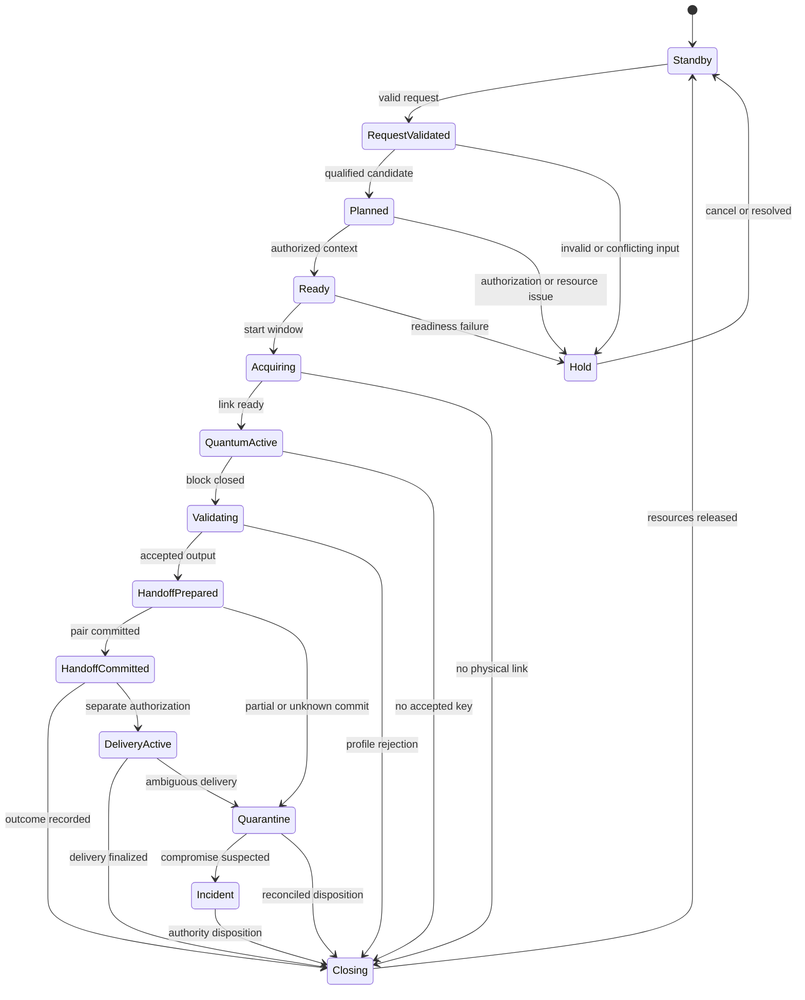
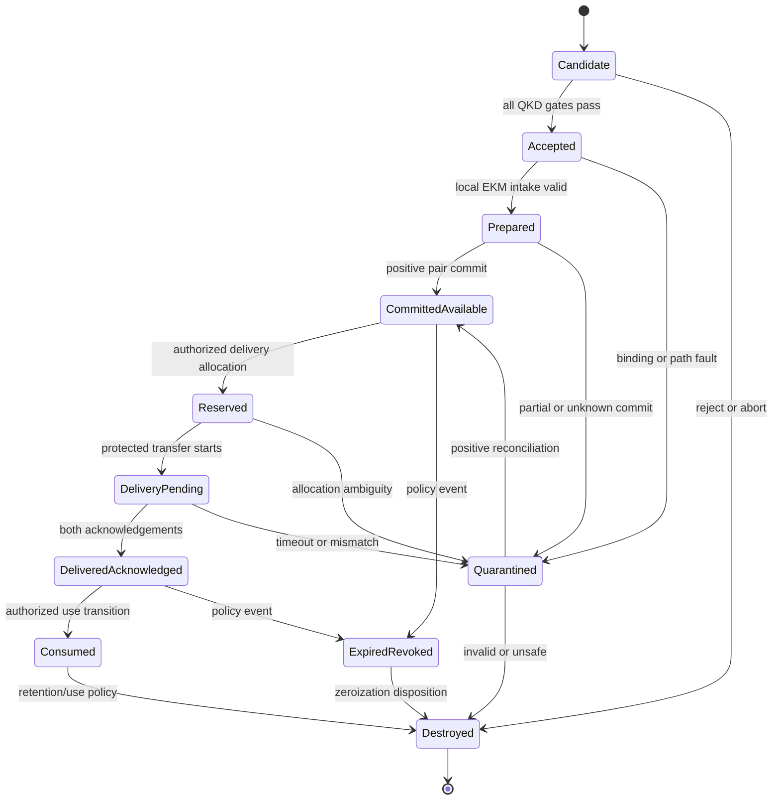
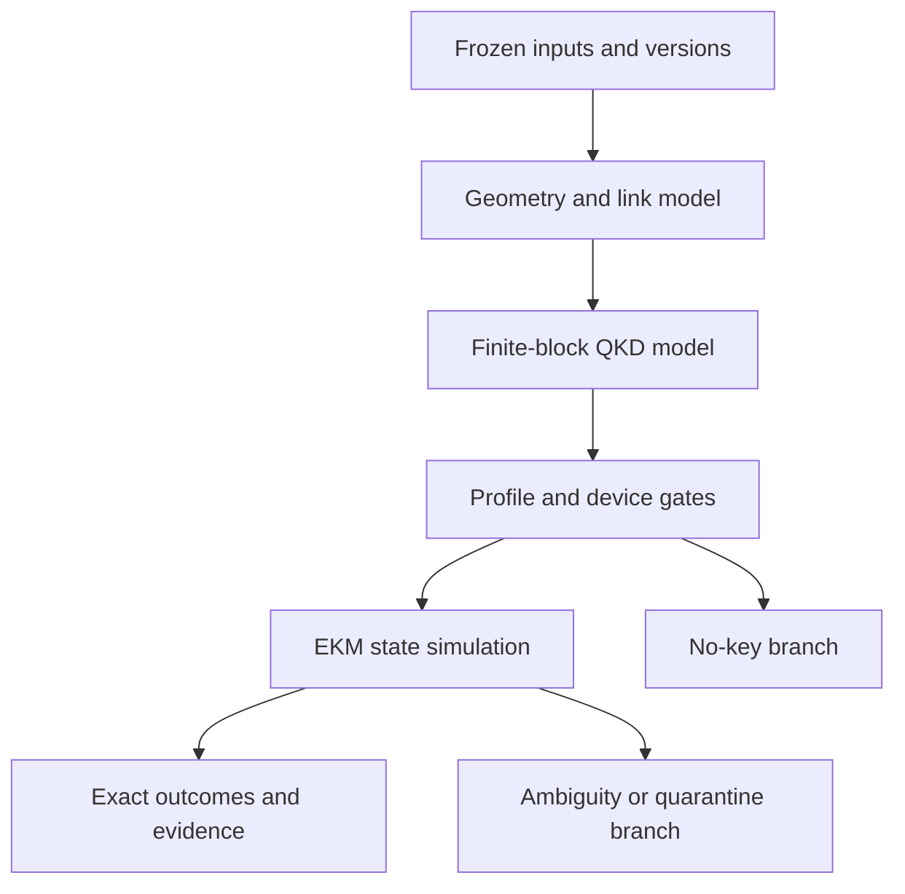

# Q-Orbit Engineering Design Handbook V0.2

## Chapter 3 — Concept of Operations and State Model

| Document field | Value |
|---|---|
| Document ID | QO-EDH-CH03 |
| Version | Correction Draft V0.2 |
| Date | 12 August 2026 |
| Parent baseline | Chapters 1–2 V0.2 and QO-EDH-REG-001 |
| Project phase | Preliminary research and engineering design |
| Approval status | Internally checked; awaiting Q-Orbit team approval |
| Information handling | Conceptual and non-operational; public release requires PR-GATE-01 |

> **Document limitation.** This chapter defines a preliminary operating concept and safe logical state behavior for the V0.2 reference case. It is not an approved operating procedure, flight rule, key-management protocol specification, safety case, or authorization to operate. `[ED:ED-016]`

---

## 3.1 Purpose and interpretation rules

This chapter describes how the direct space-to-ground reference case is requested, qualified, executed, accepted, committed to the two endpoint key managers, optionally delivered to the two local representative consumers, closed, and recovered after faults. `[ED:ED-003]`

The primary mission outcome is two-sided EKM inventory replenishment. `[ED:ED-005]`

Consumer delivery is a separate transaction with a separate completion condition and metric. `[ED:ED-005]`

The following interpretation rules apply throughout this chapter:

1. A detected optical event is not a key. `[ED:ED-008]`
2. A positive physical-link result is not QKD acceptance. `[ED:ED-008]`
3. An accepted QKD output is not available inventory until matching two-sided EKM commit is positively established. `[ED:ED-013]`
4. Available inventory is not delivered inventory until both local consumer acknowledgements are positively established. `[ED:ED-008]`
5. An ambiguous state never inherits the more permissive state. `[ED:ED-013]`
6. AQMO coordinates metadata and opportunities but cannot inspect key values or override a local security gate. `[ED:ED-010]`
7. Failure cannot silently select a different cryptographic service, trust path, protocol, endpoint, or security label. `[ED:ED-009]`
8. Every unqualified use of the word `success` is prohibited in controlled results. `[ED:ED-008]`

---

## 3.2 Reference operating abstraction

### 3.2.1 Physical, logical, and security actors

Physical equipment, logical functions, and security authorities are not interchangeable. `[ED:ED-011]`

| Actor ID | Actor | Kind | V0.2 responsibility | Basis |
|---|---|---|---|---|
| PHY-01 | Candidate LEO platform | Physical host | Hosts or supports the reference space endpoint and platform services | `[A:A-001]` |
| PHY-02 | Candidate optical ground station | Physical host | Hosts or supports the reference ground endpoint in a controlled facility | `[A:A-005]` |
| LOG-01 | QKD-A | Logical QKD endpoint | Downlink transmitter-side protocol and local acceptance functions | `[ED:ED-006]` |
| LOG-02 | QKD-B | Logical QKD endpoint | Downlink receiver-side protocol and local acceptance functions | `[ED:ED-006]` |
| LOG-03 | EKM-A | Logical key-management function | Space-domain accepted-key intake, pair-state coordination, inventory, and local delivery | `[ED:ED-005]` |
| LOG-04 | EKM-B | Logical key-management function | Ground-domain accepted-key intake, pair-state coordination, inventory, and local delivery | `[ED:ED-005]` |
| LOG-05 | AQMO | Logical orchestration function | Filters qualified opportunities, coordinates reservations, monitors metadata, and replans within authority | `[ED:ED-010]` |
| LOG-06 | Local consumer A | Logical demonstration consumer | Requests and acknowledges an authorized local key binding in endpoint domain A | `[A:A-004]` |
| LOG-07 | Local consumer B | Logical demonstration consumer | Requests and acknowledges the corresponding local binding in endpoint domain B | `[A:A-004]` |
| EXT-01 | External decision-data services | Interfacing service | Provide candidate geometry, environment, resource, time, and status data | `[TBD:TBD-012]` |
| ROLE-01 | Operations authority | Human/organizational role | Authorizes execution within the future operations policy and handles holds | `[TBD:TBD-011]` |
| ROLE-02 | Cryptographic authority | Human/organizational role | Approves protocol, authentication, key lifecycle, and cryptographic policy | `[TBD:TBD-007]` |
| ROLE-03 | Risk authority | Human/organizational role | Accepts deployment-specific risk; no such acceptance is claimed in V0.2 | `[TBD:TBD-017]` |
| ROLE-04 | Information owner/release reviewer | Human/organizational role | Dispositions PR-GATE-01 before any public release | `[TBD:TBD-020]` |

The future physical placement, ownership, and cryptographic boundary of each EKM remain unresolved. `[TBD:TBD-008]`

The future named people or organizations filling ROLE-01 through ROLE-04 remain unresolved. `[TBD:TBD-001]`

### 3.2.2 Responsibility model

`A` means the future accountable authority, `R` the responsible function, `C` a consulted role or function, and `I` an informed function. `[ED:ED-011]`

| Activity | Operations authority | AQMO | QKD-A/B | EKM-A/B | Crypto/risk authority |
|---|---|---|---|---|---|
| Define mission/key demand | A/R | C | I | C | C |
| Filter hard constraints | A | R | C | C | C |
| Authorize a candidate execution | A/R | C | I | I | C |
| Enforce local QKD security gates | I | I | R | I | A/Crypto |
| Accept or reject protocol output | I | I | R | C | A/Crypto |
| Prepare and commit paired inventory | I | I | C | R | A/Crypto |
| Authorize local consumer delivery | A | I | I | R | C |
| Override a local abort | Not permitted | Not permitted | Not permitted | Not permitted | Not permitted by this concept |
| Accept deployment risk | I | I | I | I | A/Risk |

The detailed delegation and human-gate policy remains open. `[TBD:TBD-011]`

No row assigns AQMO cryptographic approval, key custody, or risk-acceptance authority. `[ED:ED-010]`

---

## 3.3 Operating modes and mission phases

### 3.3.1 Modes

| Mode | Name | Purpose | Key-release posture |
|---|---|---|---|
| MODE-0 | Standby | Maintain known configuration and readiness status without an active opportunity | No new release |
| MODE-1 | Plan | Validate a request, construct candidates, and apply hard constraints | No new release |
| MODE-2 | Ready | Reserve a qualified opportunity and establish authorized configuration/session context | No new release |
| MODE-3 | Acquire | Establish geometry, pointing, synchronization, and channel readiness | No new release |
| MODE-4 | Quantum active | Collect the bounded quantum/classical protocol block and complete profile processing | No release before acceptance |
| MODE-5 | Replenishment handoff | Transfer accepted output locally and establish two-sided prepared/committed EKM state | Release only after positive two-sided commit |
| MODE-6 | Consumer delivery | Run an independently authorized local delivery transaction at both endpoint domains | Release only to the authorized local consumers |
| MODE-7 | Hold/reconcile | Stop progression while resolving stale, conflicting, timed-out, or ambiguous state | No affected-key release |
| MODE-8 | Incident/quarantine | Contain suspected compromise, preserve permitted evidence, and quarantine affected material | No affected-key use or release |
| MODE-9 | Maintenance/test | Calibrate, update, test, or restore components outside an authorized mission session | Test material cannot enter operational inventory |

The mode model is a Q-Orbit engineering abstraction and does not imply a particular vendor implementation. `[ED:ED-008]`

### 3.3.2 Phases

| Phase | Name | Principal output | Open detail |
|---|---|---|---|
| PH-0 | Need/request | Validated request context and demand metadata | `[TBD:TBD-002]` |
| PH-1 | Candidate generation | Candidate pass and resource set | `[TBD:TBD-003]` |
| PH-2 | Qualification | Candidate that passes every declared hard constraint | `[TBD:TBD-011]` `[TBD:TBD-012]` |
| PH-3 | Authorization/configuration | Authorized session identity and frozen configuration references | `[TBD:TBD-007]` `[TBD:TBD-011]` |
| PH-4 | Acquisition | Positive physical-link readiness evidence | `[TBD:TBD-004]` |
| PH-5 | Quantum exchange | Bounded observation/transcript block | `[TBD:TBD-005]` `[TBD:TBD-006]` |
| PH-6 | Validation/post-processing | Accepted key output or explicit no-key result | `[TBD:TBD-005]` |
| PH-7 | EKM prepare/commit | Matching, policy-valid available inventory at both EKMs or an unusable ambiguous/quarantined state | `[TBD:TBD-009]` |
| PH-8 | Optional consumer delivery | Two-sided delivered acknowledgement or failed/held delivery transaction | `[TBD:TBD-010]` |
| PH-9 | Close/evidence | Final non-secret outcome, resource release, evidence closure, and next disposition | `[TBD:TBD-019]` |

PH-8 is optional for a replenishment mission and cannot retroactively change whether PH-7 achieved replenishment. `[ED:ED-005]`

PH-7 cannot report replenishment success when either EKM is only prepared, unknown, timed out, or quarantined. `[ED:ED-013]`

---

## 3.4 AQMO authority and control contract

### 3.4.1 Permitted inputs

AQMO may receive only authenticated and policy-authorized metadata classes. `[ED:ED-010]`

| Input class | Examples | Mandatory treatment |
|---|---|---|
| Request metadata | Endpoint pair, demand class, urgency, purpose, policy label | Validate identity, authorization, schema, and freshness |
| Opportunity metadata | Predicted access window, visibility, geometry, environment | Validate provenance, timestamp, plausibility, uncertainty, and conflicts |
| Resource metadata | Platform, terminal, power, storage, thermal, compute, personnel state | Reject incompatible or unavailable resource combinations |
| Security metadata | Credential/profile/configuration status, compromise flag, local gate state | Treat a local negative or unknown security gate as non-overridable |
| Inventory metadata | Aggregated quantity/status/age labels without key values or derivable secret content | Enforce minimization and authorization |
| Outcome metadata | Session state, explicit no-key reason, paired-commit status, delivery status | Preserve correlation and exact success-state label |

The authoritative source set, validation redundancy, freshness limits, and conflict rules remain unresolved. `[TBD:TBD-012]`

### 3.4.2 Permitted outputs

AQMO may produce candidate rankings, reservations, configuration references, bounded start/stop coordination, hold/cancel requests, monitoring alerts, and replanning recommendations. `[ED:ED-010]`

AQMO output is a coordination input and does not constitute local cryptographic acceptance. `[ED:ED-010]`

### 3.4.3 Prohibited authority

AQMO may not:

- receive, calculate, transform, store, log, or display key values; `[ED:ED-010]`
- waive authentication, finite-key, device-health, configuration, or policy gates; `[ED:ED-010]`
- convert an unknown or rejected state into an accepted state; `[ED:ED-010]`
- command an EKM to expose uncommitted, quarantined, expired, revoked, or destroyed material; `[ED:ED-010]`
- choose an undeclared fallback service after a QKD failure; `[ED:ED-009]`
- accept operational risk or approve public release. `[ED:ED-010]`

### 3.4.4 Loss of AQMO

Loss, delay, or compromise suspicion of AQMO stops new planning and nonessential orchestration commands. `[ED:ED-010]`

Local QKD and EKM functions may complete only the explicitly preauthorized bounded transaction if their local policy and security gates remain positive. `[ED:ED-010]`

AQMO loss cannot force a key to be accepted, committed, delivered, revoked, or destroyed without the endpoint policy controlling that transition. `[ED:ED-010]`

The exact preauthorization envelope and operator response remain unresolved. `[TBD:TBD-011]`

---

## 3.5 Nominal replenishment flow

### 3.5.1 Sequence

The peer protocol uses an authenticated classical channel or externally established authentication mechanism. `[V:CE-006]`

The diagram shows conceptual messages and does not specify the final authentication or EKM synchronization protocol. `[TBD:TBD-007]`

The diagram does not claim universally atomic distributed commit. `[ED:ED-013]`

### 3.5.2 Detailed nominal steps

| Step | Responsible function | Required entry condition | Controlled action/output | Failure route |
|---|---|---|---|---|
| N-01 | Operations/AQMO | Authorized request context exists | Create correlation ID and candidate set | Reject request or enter MODE-7 |
| N-02 | AQMO | Candidate data are available | Apply all hard constraints before ranking | Hold/abort on stale, conflicting, missing, or invalid critical data |
| N-03 | Operations authority | A qualified candidate exists | Authorize bounded opportunity and frozen references | Remain MODE-1 or cancel |
| N-04 | QKD-A/B and platform | Authorized configuration and resources match | Validate identity, configuration, credentials, time, health, and readiness | MODE-7 or MODE-8 |
| N-05 | QKD-A/B | Local readiness gates are positive | Acquire and synchronize the physical link | Close with physical-link failure |
| N-06 | QKD-A/B | Physical-link readiness is positive | Collect one bounded single-pass quantum/classical block | Abort or close with no accepted key |
| N-07 | QKD-A/B | Required block/transcript evidence exists | Execute authenticated post-processing and the selected finite-key/profile gates | Produce explicit no-key result on any failed gate |
| N-08 | QKD-A/B | All local acceptance gates are positive | Assign collision-resistant binding identifiers and transfer accepted output over protected local paths | MODE-8 on binding/path inconsistency |
| N-09 | EKM-A/B | Corresponding accepted outputs and bindings exist | Validate endpoint pair, profile, policy, session, quantity, and local state | Quarantine on mismatch |
| N-10 | EKM-A/B | Both sides report compatible validated intake | Record paired `Prepared` state under the same transaction/correlation context | Enter `Unknown` on timeout or disagreement |
| N-11 | EKM-A/B | Both sides have positive prepared evidence | Execute commit and obtain positive authenticated peer commit evidence | Quarantine/reconcile on partial or unknown result |
| N-12 | EKM-A/B | Matching two-sided commit is established | Mark inventory `Committed/Available` at both sides | Do not declare replenishment otherwise |
| N-13 | EKM-A/B | Final pair state is known | Send non-secret exact outcome metadata to operations/AQMO | Preserve local state if reporting fails |
| N-14 | Operations/AQMO | Final outcome and evidence references exist | Close the replenishment mission and release reservations | MODE-7 if closure evidence is incomplete |

The exact field set, identifier construction, timeout, retry, recovery, and zeroization rules remain unresolved. `[TBD:TBD-009]`

In the cited finite-key model, acceptance uses more than QBER; it also uses yield estimates, a phase-error bound, error-correction leakage, and security/correctness parameters. `[V:CE-017]`

### 3.5.3 Replenishment completion invariant

`ReplenishmentSuccess = true` only if both EKM-A and EKM-B hold positive authenticated evidence for the same committed transaction, compatible key identifiers, endpoint pair, policy/profile references, quantity, and lifecycle state. `[ED:ED-005]`

If either side is absent, prepared-only, rejected, timed out, unknown, quarantined, expired, revoked, or destroyed, `ReplenishmentSuccess = false`. `[ED:ED-013]`

No key value is included in the mission outcome message. `[ED:ED-010]`

---

## 3.6 Separate consumer-delivery flow

### 3.6.1 Sequence

The final API, key-use mode, and whether protected handles or key material are used remain unresolved. `[TBD:TBD-010]`

### 3.6.2 Delivery rules

1. Delivery may start only from matching `Committed/Available` inventory at both EKMs. `[ED:ED-008]`
2. Both consumers must be individually authenticated and authorized for the same endpoint pair, purpose, policy, key binding, and transaction context. `[ED:ED-004]`
3. Reservation prevents concurrent allocation of the same key material. `[ED:ED-008]`
4. A one-sided acknowledgement is not consumer-delivery success. `[ED:ED-005]`
5. A delivery timeout moves the pair to a policy-controlled pending, hold, or quarantine path; it does not silently return the pair to available inventory. `[ED:ED-013]`
6. Consumer-delivery failure does not rewrite the already recorded replenishment outcome. `[ED:ED-005]`
7. This local demonstration does not establish onward delivery to arbitrary remote consumers. `[ED:ED-003]`

### 3.6.3 Consumer-delivery completion invariant

`ConsumerDeliverySuccess = true` only when both authorized local consumers acknowledge corresponding delivery under the same pair binding and both EKMs establish the same final delivery state. `[ED:ED-004]`

If either acknowledgement or pair-state confirmation is missing, ambiguous, or mismatched, `ConsumerDeliverySuccess = false`. `[ED:ED-013]`

The acknowledgment, retry, consumption, expiry, revocation, and destruction protocol remains unresolved. `[TBD:TBD-010]`

---

## 3.7 Session state model

### 3.7.1 State diagram

The state diagram separates session progression from the key-material lifecycle. `[ED:ED-008]`

`HandoffCommitted` is the only nominal state that can establish replenishment success. `[ED:ED-005]`

`DeliveryActive` belongs to a separate consumer-delivery transaction and is not required to establish replenishment success. `[ED:ED-005]`

### 3.7.2 Session-state definitions

| Session state | Entry evidence | Permitted next action | Explicit non-claim |
|---|---|---|---|
| Standby | No active session; configuration/readiness status is known | Validate a new request or enter maintenance | No active opportunity or key result |
| RequestValidated | Request identity, authority, schema, purpose, and demand context pass | Construct candidates | No geometry or resource qualification yet |
| Planned | At least one candidate passes all declared hard constraints | Seek bounded authorization and reserve resources | Ranking does not authorize execution |
| Ready | Authorization, session ID, endpoint pair, profile/configuration references, resources, and security metadata are compatible | Start acquisition within the window | Ready is not physical-link success |
| Acquiring | Authorized window is active and acquisition starts | Establish pointing/synchronization/channel readiness | Detection is not QKD acceptance |
| QuantumActive | Physical link is ready and the bounded protocol block is active | Close the block and validate | No key is accepted merely by collecting observations |
| Validating | Required transcript/block evidence is closed and authenticated processing runs | Produce accepted output or explicit no-key result | QBER alone cannot establish acceptance |
| HandoffPrepared | Both EKMs have compatible prepared records | Commit, query, hold, or quarantine | Prepared material is unavailable |
| HandoffCommitted | Both EKMs have positive compatible commit evidence | Record replenishment outcome; optionally start separately authorized delivery | Commit is not consumer delivery |
| DeliveryActive | Authorized local consumer transaction is bound to available inventory | Await both acknowledgements and paired delivery confirmation | One-sided receipt is not delivery success |
| Hold | Progress is blocked by a resolvable non-compromise issue | Resolve, cancel, or escalate | A hold cannot silently age into approval |
| Quarantine | Affected state/material is ambiguous, mismatched, or suspected invalid | Reconcile, revoke, destroy, or escalate | Quarantined material is unusable |
| Incident | Compromise or security-significant condition is under response | Contain, investigate, recover, and obtain authority disposition | Incident closure does not retroactively validate keys |
| Closing | Exact outcomes and permitted evidence are recorded; resources are being released | Return to Standby | Closure does not convert failures to success |

The exact entry/exit timeouts and recovery authority remain unresolved. `[TBD:TBD-009]`

The exact incident and evidence-custody process remains unresolved. `[TBD:TBD-019]`

### 3.7.3 State-transition guard rule

Every security-relevant transition requires a correlation ID, current-state match, authorized actor, compatible configuration/policy references, freshness validation, and tamper-evident non-secret evidence. `[ED:ED-013]`

A duplicate request with the same idempotency key may return the previously established state but may not repeat key allocation or delivery. `[ED:ED-013]`

A request with a reused idempotency key and different binding data is rejected and investigated. `[ED:ED-013]`

The identifier construction, replay window, and evidence fields remain unresolved. `[TBD:TBD-009]`

---

## 3.8 Key-material lifecycle model

### 3.8.1 Lifecycle diagram

Positive reconciliation may restore quarantined material only if the future policy explicitly permits restoration and proves the exact prior state. `[TBD:TBD-009]`

Fail-closed destruction is the default conceptual disposition when safe state cannot be proven. `[ED:ED-009]`

### 3.8.2 Lifecycle definitions

| Key state | Controlled meaning | May satisfy replenishment? | May satisfy delivery? | Permitted use |
|---|---|---:|---:|---|
| Candidate | Secret intermediate/final candidate associated with the bounded protocol instance before all gates pass | No | No | None |
| Accepted | Final output passes the selected protocol, finite-key, authentication, device-model, and policy gates locally | No | No | Protected handoff to its local EKM only |
| Prepared | Local EKM validates intake and records intent under a paired transaction, but positive two-sided commit is incomplete | No | No | None |
| Committed/Available | Both EKMs positively establish matching committed pair state and the material is unallocated | Yes | No | Reservation under policy |
| Reserved | Available pair is exclusively allocated to an authorized delivery transaction | Replenishment remains recorded | No | Bound delivery transaction only |
| DeliveryPending | Protected transfer has started and both acknowledgements are not yet positively established | Replenishment remains recorded | No | No reallocation |
| Delivered/Acknowledged | Both local consumers and both EKMs establish the same delivery binding/state | Replenishment remains recorded | Yes | Authorized use under key policy |
| Consumed | Authorized use transition has been recorded | Historical only | Historical only | No reallocation or repeat delivery |
| Quarantined | Validity, binding, synchronization, compromise, or lifecycle state is ambiguous or unsafe | No current availability | No | Reconciliation or destruction only |
| Expired/Revoked | Policy or authority prohibits new use | No current availability | No new delivery | Destruction/recovery process only |
| Destroyed | Zeroization/destruction disposition is recorded | No | No | None |

An `Accepted` key is not an `Available` key. `[ED:ED-008]`

An `Available` key is not a `Delivered` key. `[ED:ED-008]`

A `Delivered` key is not automatically a `Consumed` key. `[ED:ED-008]`

The exact cryptographic boundary, memory handling, retention, zeroization verification, and protected-path design remain unresolved. `[TBD:TBD-008]`

The exact consumer key-use and lifecycle semantics remain unresolved. `[TBD:TBD-010]`

### 3.8.3 Data-class handling

| Data class | Example | State/lifecycle rule |
|---|---|---|
| Public authenticated transcript | Basis announcements, decoy disclosures, error-correction messages, verification/authentication data | May cross the authenticated classical protocol channel; leakage must be included in the security analysis |
| Raw measurement/key-related data | Local basis/value records before acceptance | Remains within the applicable QKD endpoint boundary except for protocol-prescribed disclosures |
| Secret intermediate data | Reconciled strings, privacy-amplification inputs, authentication secrets, unexported candidate key | Protected within the applicable local boundary; never enters AQMO |
| Accepted final key output | Final endpoint output plus non-secret binding metadata | Crosses only the protected local QKD-to-EKM path |
| Stored/available/delivered key | EKM-held or consumer-delivered value/handle | Follows the EKM/consumer lifecycle and never enters AQMO |
| Non-secret operational metadata | Quantity/status/reason/profile/reference identifiers | May be minimized and sent to AQMO if authorized and non-derivable |

The selected prepare-and-measure profile requires an authenticated classical channel. `[V:CE-006]`

The V0.2 data-class model does not classify every authenticated transcript message as secret. `[ED:ED-011]`

The exact permitted transcript and device-specific leakage accounting must be frozen in the protocol dossier. `[TBD:TBD-005]`

---

## 3.9 Safe EKM coordination semantics

### 3.9.1 Conceptual pair-state protocol

The V0.2 model uses `Prepared`, `Committed`, and `Unknown` as conceptual pair-state outcomes. `[ED:ED-013]`

`Prepared` means the local EKM has durably recorded compatible intake and transaction intent but the pair is not available. `[ED:ED-013]`

`Committed` means both EKMs have positive authenticated evidence that the same pair binding reached the committed state. `[ED:ED-013]`

`Unknown` means an EKM cannot prove whether the peer reached the required state, including after timeout, response loss, restart, or conflicting records. `[ED:ED-013]`

An `Unknown` pair is quarantined and unusable until a permitted reconciliation or destruction disposition completes. `[ED:ED-013]`

### 3.9.2 Required properties for the future protocol

| Property | Safe conceptual behavior | Closure route |
|---|---|---|
| Pair binding | Bind endpoint pair, session, profile/configuration, policy, quantity, and compatible key identifiers | `[TBD:TBD-009]` |
| Authentication | Authenticate EKM identity, message integrity, freshness, and authorization | `[TBD:TBD-007]` |
| Idempotency | Repeated same-operation requests return the established result without duplicate allocation or delivery | `[TBD:TBD-009]` |
| Compare-and-transition | Reject an operation when the expected prior state does not match | `[TBD:TBD-009]` |
| Timeout | Convert loss of certainty to `Unknown`, not to success or automatic rollback | `[TBD:TBD-009]` |
| Status query | Permit authenticated peer-state query bound to the transaction and current evidence version | `[TBD:TBD-009]` |
| Reconciliation | Require compatible positive evidence or destroy/revoke the pair; never guess | `[TBD:TBD-009]` |
| Restart recovery | Restore state from protected durable records without replaying key exposure | `[TBD:TBD-009]` |
| Audit | Record actors, state versions, reasons, references, and timestamps without key values | `[TBD:TBD-019]` |
| Zeroization | Verify disposition of rejected, duplicate, ambiguous, expired, revoked, and destroyed material | `[TBD:TBD-009]` |

These properties do not assert that arbitrary distributed key stores can provide perfect atomicity under every failure. `[ED:ED-013]`

The future design must define its fault model and prove which outcomes remain possible after crash, partition, delay, duplication, reordering, or compromise. `[TBD:TBD-009]`

### 3.9.3 Partial-commit rule

If one EKM reports `Committed` and the peer reports `Prepared`, `Unknown`, no response, or conflicting evidence, neither side may expose the affected pair as available. `[ED:ED-013]`

The pair enters quarantine/reconciliation, the exact uncertainty is recorded, and AQMO receives only a non-secret `commit-ambiguous` outcome. `[ED:ED-013]`

Automatic retry may query or repeat an idempotent state operation, but it may not allocate a new key ID, expose the pair, or reinterpret a timeout as success. `[ED:ED-013]`

---

## 3.10 Compatibility across modes, phases, session states, and key states

| Mode | Compatible phases | Compatible session states | Compatible key states | Prohibited interpretation |
|---|---|---|---|---|
| MODE-0 Standby | PH-0 | Standby | Existing lifecycle states may persist under policy | Standby does not mean empty inventory |
| MODE-1 Plan | PH-0–PH-2 | RequestValidated, Planned, Hold | No new session key state | A ranked candidate is not authorized |
| MODE-2 Ready | PH-3 | Ready, Hold | No new session key state | Ready is not a physical result |
| MODE-3 Acquire | PH-4 | Acquiring, Hold, Closing | Candidate may begin only under the authorized protocol context | Link acquisition is not QKD acceptance |
| MODE-4 Quantum active | PH-5–PH-6 | QuantumActive, Validating, Closing, Incident | Candidate, Accepted, Destroyed, Quarantined | Accepted is not available |
| MODE-5 Replenishment handoff | PH-7 | HandoffPrepared, HandoffCommitted, Quarantine, Closing | Accepted, Prepared, Committed/Available, Quarantined, Destroyed | Prepared or one-sided commit is not replenishment success |
| MODE-6 Consumer delivery | PH-8 | DeliveryActive, Quarantine, Closing | Committed/Available, Reserved, DeliveryPending, Delivered/Acknowledged, Quarantined | One-sided acknowledgement is not delivery success |
| MODE-7 Hold/reconcile | Any affected phase | Hold, Quarantine, Closing | Unchanged safe state or Quarantined | Time does not turn unknown into approved |
| MODE-8 Incident/quarantine | Any affected phase | Incident, Quarantine, Closing | Quarantined, Expired/Revoked, Destroyed | Incident recovery cannot retroactively prove prior success |
| MODE-9 Maintenance/test | Outside a mission phase | Standby or separately labeled maintenance state | Test-only material, Quarantined, Destroyed | Test key material cannot enter mission inventory |

State compatibility is enforced before any transition or result publication. `[ED:ED-008]`

The future implementation must reject impossible combinations rather than normalize them silently. `[ED:ED-009]`

---

## 3.11 Off-nominal and failure branches

| Branch | Trigger/evidence | Mandatory safe outcome | Exact result label |
|---|---|---|---|
| F-01 Invalid request | Identity, authority, schema, purpose, or demand validation fails | Reject before planning; create no session key state | `request-rejected` |
| F-02 Stale external data | Critical source exceeds its policy freshness bound | Hold or abort until current compatible evidence exists | `data-stale` |
| F-03 Conflicting authenticated data | Two signed/authorized sources disagree on a security-critical value | Record conflict; apply only a predeclared resolution rule or hold/abort | `data-conflict` |
| F-04 Resource/configuration mismatch | Reserved resource, profile, credential, time, or configuration differs from authorization | Do not start or continue the affected session | `readiness-rejected` |
| F-05 Physical acquisition failure | Pointing, synchronization, channel, or readiness criterion fails | Close with no QKD acceptance claim | `physical-link-failed` |
| F-06 Authentication failure | Classical protocol authentication/freshness/session binding fails | Abort; accept no key; contain affected authentication state | `authentication-failed` |
| F-07 Finite-key/profile rejection | Selected key-length or other protocol gate is non-positive/failed | Produce no accepted key; destroy/quarantine affected material | `qkd-rejected` |
| F-08 Device-health failure | Source, detector, entropy, timing, calibration, or operating-envelope gate fails | Abort or quarantine; do not rely on protocol calculation alone | `device-gate-failed` |
| F-09 Local handoff/binding mismatch | QKD-to-EKM path or metadata does not match authorized context | Quarantine; do not prepare pair state | `handoff-rejected` |
| F-10 Partial/unknown EKM commit | Peer timeout, restart, response loss, or incompatible pair records | Mark pair unusable; reconcile or destroy | `commit-ambiguous` |
| F-11 Wrong consumer/binding | Consumer identity, purpose, endpoint, policy, key ID, or state is incompatible | Reject delivery; preserve available state only if non-exposure is proven | `delivery-rejected` |
| F-12 One-sided delivery acknowledgement | Only one consumer or EKM establishes the final delivery state | Prevent reallocation; hold/quarantine pending safe disposition | `delivery-ambiguous` |
| F-13 AQMO loss | Orchestrator becomes unavailable or suspect | Stop new coordination; local gates control any preauthorized bounded completion | `orchestration-unavailable` |
| F-14 Endpoint/EKM compromise suspicion | Integrity evidence, audit, behavior, or authority raises compromise concern | Stop affected service; quarantine/revoke; enter incident response | `security-incident` |
| F-15 Storage/resource exhaustion | Safe capacity, authentication resource, power, compute, or contact margin is unavailable | Reject/hold without bypassing lifecycle or security policy | `resource-unavailable` |
| F-16 Audit/evidence failure | Required non-secret transition evidence cannot be created or validated | Block the affected security-relevant transition or enter hold | `evidence-failed` |
| F-17 Public-release gate failure | Any PR-GATE-01 check lacks a positive disposition | Do not publish the affected artifact | `release-blocked` |

Authenticated data can still be incorrect, so F-03 cannot be reduced to a signature check. `[ED:ED-012]`

QKD cannot by itself prevent denial of service. `[V:CE-007]`

Q-Orbit therefore records F-05, F-13, and F-15 as availability outcomes rather than evidence of secret-key compromise. `[ED:ED-011]`

No failure branch authorizes a silent fallback. `[ED:ED-009]`

Any future non-QKD fallback requires a separately approved service definition and scenario. `[TBD:TBD-018]`

---

## 3.12 Exact outcome and measurement model

### 3.12.1 Four independent outcome states

| Outcome ID | Outcome | Positive condition | Negative/indeterminate handling |
|---|---|---|---|
| OUT-1 | Physical-link success | The declared acquisition, synchronization, and channel-readiness criteria pass for the run | Report physical failure or indeterminate; do not infer QKD acceptance |
| OUT-2 | QKD acceptance | The exact protocol/profile calculation is positive and every authentication, device, configuration, and policy gate passes | Report explicit no-key/rejection; do not hand off accepted output |
| OUT-3 | Replenishment success | Both EKMs establish matching `Committed/Available` state for the same binding | Report failed/ambiguous; quarantine any uncertain pair |
| OUT-4 | Consumer-delivery success | Both local consumers acknowledge corresponding authorized delivery and both EKMs establish the same delivered state | Report failed/ambiguous; prevent unsafe reallocation |

OUT-1 through OUT-4 are separately recorded booleans or enumerated outcomes and may not be collapsed into an unqualified `success` field. `[ED:ED-008]`

OUT-2 cannot be inferred from QBER alone. `[V:CE-017]`

OUT-3 is the primary mission outcome for the V0.2 reference case. `[ED:ED-005]`

OUT-4 is a separate optional transaction outcome. `[ED:ED-005]`

### 3.12.2 Candidate measures

| Measure ID | Measure | Numerator | Denominator/reference | Unit/state |
|---|---|---|---|---|
| MET-01 | Candidate qualification rate | Candidates passing every declared hard constraint | Candidate opportunities evaluated | Fraction |
| MET-02 | Physical-link success rate | Runs with OUT-1 positive | Authorized acquisition attempts | Fraction |
| MET-03 | QKD acceptance rate | Runs with OUT-2 positive | Runs entering bounded quantum exchange | Fraction |
| MET-04 | Replenishment success rate | Runs with OUT-3 positive | Runs producing accepted output at both endpoints | Fraction |
| MET-05 | Consumer-delivery success rate | Transactions with OUT-4 positive | Authorized local delivery transactions | Fraction |
| MET-06 | Accepted key length | Accepted final key output before EKM commit | Per run/session | Bits |
| MET-07 | Committed available quantity | Matching two-sided EKM inventory committed | Per pair/transaction | Bits or key objects |
| MET-08 | Replenishment completion latency | Request reference time to positive two-sided commit | Per successful replenishment mission | Time |
| MET-09 | Consumer-delivery latency | Delivery authorization to positive two-sided acknowledgement | Per successful delivery transaction | Time |
| MET-10 | Ambiguous-state incidence | Commit or delivery transactions entering unknown/quarantine | Applicable transactions | Count/fraction |
| MET-11 | Safe-rejection coverage | Injected negative cases that produce the specified fail-closed state | Selected injected negative cases | Fraction |
| MET-12 | Evidence completeness | Required non-secret evidence records present and valid | Required records for the exact outcome | Fraction |

Numeric thresholds for all measures remain unresolved until mission need and model provenance are approved. `[TBD:TBD-013]`

MET-03, MET-04, and MET-05 use different denominators and may not be compared without showing those denominators. `[ED:ED-008]`

### 3.12.3 Minimum controlled result record

Every simulation or test result must name:

- the exact outcome state or measure ID; `[ED:ED-008]`
- the run/session and configuration identifiers; `[ED:ED-008]`
- the code, dependency, input-data, parameter-register, and random-seed versions; `[ED:ED-007]`
- the source/applicability and uncertainty or range for every numeric input; `[ED:ED-007]`
- all acceptance gates and their pass/fail/unknown states; `[ED:ED-008]`
- the relevant limitations and excluded claims; `[ED:ED-007]` and
- the reviewer and PR-GATE-01 status if the result is proposed for publication. `[ED:ED-015]`

The detailed evidence schema remains unresolved. `[TBD:TBD-019]`

---

## 3.13 Reference simulation concept and parameter provenance

### 3.13.1 Frozen analysis profile

The V0.2 computational reference is a downlink, polarization prepare-and-measure, phase-randomized weak-coherent-pulse efficient-BB84 profile with one signal and two decoy intensities. `[ED:ED-006]`

The reference finite-block method is the single-pass method described by Sidhu et al. 2022. `[ED:ED-007]`

The cited paper analyzes finite received blocks because limited satellite passes make asymptotic treatment potentially optimistic. `[V:CE-015]`

The cited method uses a three-intensity profile that includes two decoys. `[V:CE-016]`

Selecting this reference for analysis does not approve an operational protocol or device. `[ED:ED-006]`

The equations, conventions, security parameters, and numerical implementation must be independently reproduced before any result is treated as validated. `[TBD:TBD-005]`

### 3.13.2 Parameter and provenance groups

| Group | Required fields/examples | Permitted source route | Owner/open issue |
|---|---|---|---|
| Orbit/time | Orbit state, epoch, propagation method, analysis interval, pass selection | Versioned orbit source or explicit analysis range | `[TBD:TBD-003]` |
| Geometry | Range, elevation, access, slew/track constraints | Reproducible geometry model | `[TBD:TBD-003]` |
| Optical link | Wavelength, apertures, divergence, transmission, pointing, turbulence/background, detector coupling | Source-backed values or explicit sensitivity ranges | `[TBD:TBD-004]` |
| Source | Intensity probabilities/means, repetition rate, state preparation, randomness assumptions | Selected proof/device dossier | `[TBD:TBD-005]` `[TBD:TBD-006]` |
| Receiver | Efficiency, dark/background counts, timing/gating, saturation and operating envelope | Characterization evidence or explicit provisional range | `[TBD:TBD-006]` |
| Protocol | Basis probabilities, block definition, decoy estimation, error correction, verification, privacy amplification | Reproduced reference method plus approved deviations | `[TBD:TBD-005]` |
| Security | Secrecy/correctness budgets, authentication treatment, finite-size allocation | Protocol/crypto authority decision | `[TBD:TBD-005]` `[TBD:TBD-007]` |
| Device health | Calibration, entropy, self-test, monitor thresholds, invalid-state rules | Proof-to-device assumption map | `[TBD:TBD-006]` |
| Key management | Binding, pair-state protocol, timeouts, retries, storage and zeroization | EKM specification and negative tests | `[TBD:TBD-008]` `[TBD:TBD-009]` |
| Consumer delivery | API, authorization, reservation, acknowledgement, consumption and expiry | Interface specification and lifecycle tests | `[TBD:TBD-010]` |
| AQMO/data | Hard constraints, freshness, conflict, authority, reservation and replanning | Control contract and replay/fault tests | `[TBD:TBD-011]` `[TBD:TBD-012]` |

No numeric value from a demonstration paper is a Q-Orbit design parameter merely because it is published. `[ED:ED-007]`

Every numeric value must carry units, uncertainty or range, source, applicability rationale, and sensitivity treatment. `[ED:ED-007]`

### 3.13.3 Reproducible run pipeline

The August reference pipeline uses deterministic configuration capture and recorded random seeds so a reviewer can reproduce the same run. `[ED:ED-014]`

The simulation must preserve each gate result rather than emitting only a final key-rate number. `[ED:ED-008]`

The simulation may inject logical faults for stale/conflicting input, authentication rejection, profile rejection, partial EKM commit, and wrong/one-sided consumer delivery. `[A:A-008]`

Model-level fault injection does not substitute for device characterization, penetration testing, or independent operational evaluation. `[A:A-008]`

### 3.13.4 August evidence boundary

The August target is one coherent reproducible reference simulation with selected negative cases and traceable inputs. `[ED:ED-014]`

The August target is not a validated flight link budget, certified cryptographic implementation, tested space terminal, approved EKM product, production AQMO, or operational risk decision. `[ED:ED-014]`

---

## 3.14 Audit and evidence concept

### 3.14.1 Minimum non-secret event classes

| Event class | Examples | Prohibited content |
|---|---|---|
| Identity/authorization | Actor, role, decision, credential/config reference, result | Credential secrets or key values |
| Session transition | Prior/new state, event, reason, correlation ID, evidence version | Raw or intermediate key data |
| Profile/device gate | Gate ID, pass/fail/unknown, profile/config reference | Sensitive calibration detail unless separately authorized |
| EKM pair state | Prepared/committed/unknown/quarantined status, pair binding reference | Key values or data that derives them |
| Consumer delivery | Request/binding reference, authorized consumer ID, acknowledgement status | Delivered key value |
| AQMO decision | Candidate set reference, hard-constraint results, ranking/config reference | Key values or unminimized sensitive inputs |
| Incident/recovery | Detection, containment, authority decision, disposition reference | Publicly releasable claim without PR-GATE-01 |
| Publication | Artifact version, source/result mapping, reviewer, PR-GATE-01 disposition | Sensitive operational detail |

AQMO audit data contains no key values. `[ED:ED-010]`

Audit evidence supports review and reconstruction but does not by itself prove that the underlying source data were correct. `[ED:ED-012]`

The authoritative time source, schema, retention, privacy, correlation, integrity, custody, and access policy remain unresolved. `[TBD:TBD-019]`

### 3.14.2 Evidence continuity rule

Each transition record must reference its predecessor or expected prior-state version so deletion, duplication, reordering, rollback, and cross-session mixing can be detected. `[ED:ED-013]`

If required evidence continuity cannot be established, the affected transition is held or rejected. `[ED:ED-009]`

---

## 3.15 Design-driving operating scenarios

### OPS-01 — Nominal replenishment without consumer delivery

One authorized pass produces accepted outputs at both QKD endpoints, both EKMs prepare and commit the same pair binding, OUT-3 is positive, and the mission closes without entering MODE-6. `[ED:ED-005]`

OUT-4 is recorded as `not-requested`, not failed and not successful. `[ED:ED-008]`

### OPS-02 — Nominal replenishment followed by local delivery

OUT-3 is positively established before the separate consumer-delivery authorization begins. `[ED:ED-005]`

Both consumers acknowledge the same authorized pair binding, both EKMs establish delivered state, and OUT-4 becomes positive. `[ED:ED-004]`

### OPS-03 — Positive QKD acceptance followed by ambiguous commit

OUT-2 is positive, but one EKM cannot prove compatible two-sided commit after a response loss. `[ED:ED-013]`

OUT-3 is not positive, both sides prevent availability, and the affected pair enters quarantine/reconciliation. `[ED:ED-013]`

### OPS-04 — Replenishment succeeds but delivery is one-sided

OUT-3 remains the recorded replenishment result, while OUT-4 is `ambiguous/failed`. `[ED:ED-005]`

The reserved pair cannot be reallocated until the delivery ambiguity is safely resolved. `[ED:ED-013]`

### OPS-05 — Conflicting signed weather or ephemeris inputs

The conflict is recorded and the opportunity is held or aborted unless a predeclared resolution rule yields a valid current input. `[ED:ED-012]`

A valid signature alone does not select which value is correct. `[ED:ED-012]`

### OPS-06 — AQMO becomes unavailable mid-session

No new candidate or configuration is authorized, and local functions complete only a preauthorized bounded transaction whose local security gates remain positive. `[ED:ED-010]`

No endpoint treats AQMO unavailability as permission to bypass a gate. `[ED:ED-010]`

### OPS-07 — QKD opportunity fails with pressure to maintain service

The QKD transaction returns the exact negative outcome and no accepted key. `[ED:ED-009]`

No alternate algorithm, key source, relay, endpoint, or label is selected unless a separate preapproved fallback service exists. `[TBD:TBD-018]`

### OPS-08 — Website result proposed for publication

The exact metric, denominators, assumptions, parameter provenance, limitations, and source applicability are packaged for review. `[ED:ED-015]`

The result remains unpublished until PR-GATE-01 receives a positive recorded disposition. `[ED:ED-015]`

---

## 3.16 Candidate operational obligations — not baselined requirements

The following atomic candidates are inputs to Chapter 4 disposition and are not approved requirements. `[ED:ED-016]`

| ID | Atomic candidate obligation | Candidate verification method |
|---|---|---|
| OPS-OBL-001 | Assign a unique correlation identity to every request, session, pair-state transaction, and delivery transaction. | Identifier uniqueness/collision/replay tests |
| OPS-OBL-002 | Validate request identity, authority, purpose, schema, and freshness before candidate generation. | Invalid-request negative tests |
| OPS-OBL-003 | Filter every hard-constraint violation before candidate ranking. | Constraint property tests and replay |
| OPS-OBL-004 | Record the exact frozen profile, configuration, endpoint pair, and policy references before acquisition. | Configuration trace inspection |
| OPS-OBL-005 | Require positive local readiness gates at both endpoints before bounded quantum exchange. | Readiness fault injection |
| OPS-OBL-006 | Authenticate and bind the classical protocol transcript to the current session. | Authentication/replay/cross-session tests |
| OPS-OBL-007 | Produce no accepted key when any selected finite-key/profile gate fails. | Boundary and negative key-length tests |
| OPS-OBL-008 | Produce no accepted key when a required device-health or operating-envelope gate fails. | Device-state fault injection |
| OPS-OBL-009 | Prevent AQMO from receiving or deriving any key value. | Interface/data-flow inspection |
| OPS-OBL-010 | Prevent AQMO from overriding a local reject, abort, hold, quarantine, revocation, or destruction state. | Authority negative tests |
| OPS-OBL-011 | Transfer accepted output only over the protected local QKD-to-EKM path. | Boundary and path inspection |
| OPS-OBL-012 | Bind every accepted output to its endpoint pair, session, profile/configuration, purpose, policy, and compatible key identifiers. | Wrong-binding tests |
| OPS-OBL-013 | Keep prepared-only key material unavailable. | Prepared-state access negative test |
| OPS-OBL-014 | Declare replenishment success only after positive matching two-sided commit evidence. | Partial-commit and response-loss tests |
| OPS-OBL-015 | Convert commit uncertainty to an unusable unknown/quarantined state. | Timeout/restart/partition tests |
| OPS-OBL-016 | Make EKM state operations idempotent against duplicate requests. | Duplicate/reorder/retry tests |
| OPS-OBL-017 | Reject a reused idempotency key carrying different binding data. | Mutation/replay tests |
| OPS-OBL-018 | Prevent automatic rollback from exposing an ambiguously committed pair. | Crash/timeout recovery test |
| OPS-OBL-019 | Start consumer delivery only from matching committed/available pair state. | Invalid-origin state tests |
| OPS-OBL-020 | Reserve a pair exclusively before protected consumer transfer. | Concurrent-allocation test |
| OPS-OBL-021 | Authenticate and authorize each local consumer against the same pair binding. | Wrong-consumer/purpose/policy tests |
| OPS-OBL-022 | Declare consumer-delivery success only after both acknowledgements and paired EKM confirmation. | One-sided/lost-acknowledgement tests |
| OPS-OBL-023 | Prevent an ambiguously delivered pair from automatic reallocation. | Delivery-timeout recovery test |
| OPS-OBL-024 | Keep replenishment and consumer-delivery outcomes in separate fields and metrics. | Schema and reporting tests |
| OPS-OBL-025 | Label every controlled result with its exact outcome ID and denominator. | Report-schema validation |
| OPS-OBL-026 | Record code, dependency, input, parameter, and random-seed versions for each simulation run. | Reproducibility review |
| OPS-OBL-027 | Record source, unit, uncertainty/range, applicability, and sensitivity for every numeric input. | Parameter-register completeness test |
| OPS-OBL-028 | Preserve individual protocol, device, authentication, policy, and state gate results. | Evidence-schema inspection |
| OPS-OBL-029 | Treat stale or conflicting security-critical external data as hold/abort unless a predeclared rule resolves it. | Stale/conflicting-source injection |
| OPS-OBL-030 | Stop new coordination when AQMO is unavailable or suspected compromised. | Orchestrator-loss test |
| OPS-OBL-031 | Record tamper-evident non-secret transition evidence without key values. | Log integrity/content tests |
| OPS-OBL-032 | Block publication until PR-GATE-01 has a positive recorded disposition. | Release-workflow negative test |

Every candidate obligation requires owner, rationale, allocation, acceptance criteria, verification level, and approval status before it can become a requirement. `[ED:ED-016]`

---

## 3.17 Traceability and evidence packages

### 3.17.1 Chapter traceability

| Chapter 1/2 decision or threat | Chapter 3 disposition |
|---|---|
| Direct QKD link and no trusted relay | §§3.2, 3.5, and 3.15 preserve one QKD-A/QKD-B pair |
| Replenishment is primary; delivery is separate | §§3.1, 3.5, 3.6, 3.8, and 3.12 define separate states and metrics |
| QBER is not the sole acceptance metric | §§3.5 and 3.13 preserve full selected profile gates |
| Raw/intermediate/final data distinction | §3.8.3 defines data-class paths and AQMO exclusion |
| Ambiguous EKM commit | §§3.7–3.11 define unknown, quarantine, reconciliation, and exact failure labels |
| Wrong/one-sided consumer delivery | §§3.6, 3.8, 3.11, and 3.15 prevent false delivery success/reallocation |
| AQMO compromise/loss | §§3.4, 3.11, and 3.15 constrain authority and local completion |
| Stale/conflicting authenticated inputs | §§3.4, 3.11, and 3.15 require hold/abort or a predeclared rule |
| No silent downgrade | §§3.1, 3.11, and 3.15 prohibit implied fallback |
| Public-release exposure | §§3.11, 3.14, and 3.15 enforce PR-GATE-01 |

### 3.17.2 Required next-stage evidence

| Evidence package | Minimum content | Open issue |
|---|---|---|
| Mission/measure package | Demand, consequence, units, exact outcomes, thresholds, denominators | `[TBD:TBD-002]` `[TBD:TBD-013]` |
| Geometry/link package | Orbit/site inputs, propagation, link model, uncertainties, sensitivity | `[TBD:TBD-003]` `[TBD:TBD-004]` |
| Protocol package | Exact equations, proof assumptions, parameters, authentication, leakage, accept/no-key logic | `[TBD:TBD-005]` `[TBD:TBD-007]` |
| Device package | Source/detector/entropy/timing/calibration model, health gates, side-channel assumptions | `[TBD:TBD-006]` |
| Boundary/EKM package | Physical/logical boundaries, protected paths, pair protocol, recovery, zeroization | `[TBD:TBD-008]` `[TBD:TBD-009]` |
| Consumer package | API, identity, binding, reservation, acknowledgement, consumption, expiry, destruction | `[TBD:TBD-010]` |
| AQMO/data package | Authority contract, constraints, input sources, freshness/conflict rules, loss behavior | `[TBD:TBD-011]` `[TBD:TBD-012]` |
| Verification package | Independent model review, selected negative cases, expected evidence, qualified reviewers | `[TBD:TBD-015]` |
| Audit/incident package | Schema, time, integrity, retention, custody, privacy, response and recovery | `[TBD:TBD-019]` |
| Release package | Artifact inventory, claim/source map, sensitivity check, recorded PR-GATE-01 decision | `[TBD:TBD-020]` |

---

## 3.18 Review Gate CH3-G1-V0.2

Chapter 3 is ready for Q-Orbit team baseline approval when the team accepts:

1. the separate physical, logical, and authority actors in §3.2;
2. the operating modes and phases without treating them as vendor implementation states;
3. AQMO's no-key, no-security-override, and bounded-loss behavior;
4. replenishment completion only at matching two-sided EKM commit;
5. consumer delivery as a separate optional transaction with two-sided acknowledgement;
6. the session-state and key-lifecycle models as separate but compatible models;
7. `Prepared / Committed / Unknown` safe semantics without a universal atomicity claim;
8. the exact OUT-1 through OUT-4 result model and denominators;
9. the profile-specific reproducible simulation and parameter-provenance rule;
10. the off-nominal branches, especially partial commit, one-sided delivery, conflicting signed data, and AQMO loss;
11. the 32 candidate obligations as non-normative Chapter 4 inputs; and
12. the evidence packages and PR-GATE-01 dependency.

Approval means acceptance of a preliminary concept and logical state model, not approval of an operating procedure, cryptographic implementation, mission operation, or residual risk. `[ED:ED-016]`
