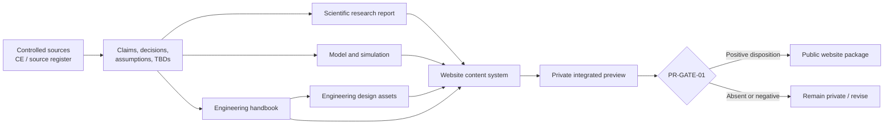

# Q-Orbit Integrated Content, Research, Engineering & Website Plan V0.3

## Planning Baseline

| Field | Value |
|---|---|
| Document ID | QO-ICP-001 |
| Version | Proposed Integrated Plan V0.3 |
| Date | 12 August 2026 |
| Parent material | QO-EDH-REG-001 and Q-Orbit Engineering Design Handbook Chapters 1–4 V0.2 |
| Target milestone | 31 August 2026 |
| Planning status | Proposed; PLAN-G1 decision pending |
| Product maturity | Preliminary scientific research and preliminary engineering design only |
| Website status | Private design/preview may proceed; public release remains subject to PR-GATE-01 |

> **Scope boundary.** This plan organizes research, preliminary engineering, design assets, simulation evidence, and a website presentation. It does not authorize procurement, fabrication, deployment, flight, certification, cryptographic approval, operational risk acceptance, or a claim that SQDS is secure or mission-ready.

---

## 1. Plan Objective

Produce one coherent Q-Orbit evidence package with four synchronized deliverables:

1. a preliminary scientific research report;
2. a preliminary engineering design handbook;
3. a controlled engineering-design asset pack; and
4. a website that presents the research, engineering, designs, and results at appropriate levels of detail.

The package shall tell one consistent story:

> Q-Orbit studies whether a bounded, direct satellite-to-ground QKD reference service, paired with two-sided endpoint key management and constrained orchestration, can be modeled and described coherently without overstating security, performance, or operational readiness.

The project is not attempting to deliver a flight design or an operational cryptographic service by the target milestone.

---

## 2. One Source, Four Outputs

### 2.1 Single-source rules

- The controlled registers remain the source of truth for claims, sources, decisions, assumptions, and open issues.
- The engineering handbook owns the preliminary system definition, architecture, requirements, interfaces, and verification intent.
- The scientific report owns the research question, literature synthesis, method, modeled results, discussion, and research limitations.
- Simulation outputs are evidence artifacts, not free-standing security or mission claims.
- The website is a presentation layer derived from controlled material; it does not invent a separate technical narrative.
- Every public technical claim shall map to at least one controlled evidence entry and retain its applicability limit.
- Every quantitative result shall display the model/configuration version, parameter basis, metric definition, uncertainty or sensitivity treatment, and limitation.
- Every engineering figure shall have a stable asset ID, version, source chapter, status label, and claim boundary.

---

## 3. Deliverable Architecture

| ID | Deliverable | Purpose | Target form | Completion test |
|---|---|---|---|---|
| DEL-RES-001 | Preliminary Scientific Research Report | Establish the scientific question, evidence, method, preliminary findings, and limits | Standalone report/PDF plus web-readable sections | All claims and results trace to controlled sources/configurations; limitations are explicit |
| DEL-ENG-001 | Preliminary Engineering Design Handbook | Define the preliminary SQDS concept, architecture, requirements, analysis, and verification intent | Eight core chapters plus controlled annexes | Chapters are internally consistent and all unresolved design data remain explicit TBDs |
| DEL-DES-001 | Engineering Design Asset Pack | Provide reusable diagrams, figures, charts, and conceptual visuals | Versioned SVG-first assets with source files and fallbacks | Each asset has ID, caption, status, source trace, alt text, and web/document variants |
| DEL-WEB-001 | Q-Orbit Website | Present the project clearly to technical and non-specialist reviewers | Responsive private preview, then release-reviewed public build | Every page passes content, accessibility, technical, provenance, and release checks |
| DEL-SIM-001 | Reference Model & Simulation Package | Produce reproducible preliminary calculations and selected fail-closed cases | Versioned code, parameter register, run records, and charts | An independent rerun reproduces discrete outcomes and meets the frozen numeric tolerance |

### 3.1 Priority order

1. evidence integrity and consistency;
2. scientific and engineering clarity;
3. reproducibility;
4. visual communication and website quality; and
5. additional breadth only when it does not threaten the first four priorities.

---

## 4. Preliminary Engineering Handbook — Eight-Chapter Target

The target is eight core chapters. Detailed registers, matrices, parameter tables, and asset indexes are annexes and do not increase the core chapter count.

| Chapter | Working title | Status | Minimum content | Website contribution |
|---:|---|---|---|---|
| 1 | Mission & System Definition | Drafted and internally checked; gate pending | Problem, mission statement, topology, functional boundary, success model, cautions | Home, Project, System overview |
| 2 | Mission & Threat Analysis | Drafted and internally checked; gate pending | Assets, trust boundaries, threats, controls, claim boundary | Security & Limitations |
| 3 | Concept of Operations & State Model | Drafted and internally checked; gate pending | Actors, modes, flows, states, failure branches, outcome model | How It Works, interactive sequences |
| 4 | Proposed Requirements Baseline | Drafted and six-pass reviewed; CH4-G1 pending | Atomic proposed requirements, coverage, verification scenarios, change control | Requirements summary and full download |
| 5 | Preliminary Architecture & Engineering Design | Next | Logical/physical views, function allocation, interfaces, trust zones, data flows, design trade boundaries | System Architecture and Engineering Designs |
| 6 | Scientific Model, Assumptions & Analysis Method | Planned | Research case, orbit/site case assumptions, optical model, QKD method, uncertainty, parameter provenance | Scientific Research and Method |
| 7 | Reference Simulation & Preliminary Results | Planned | Reproducible runs, sensitivity, no-key cases, selected logical faults, result interpretation | Simulation & Results |
| 8 | Verification, Limitations, Roadmap & Release | Planned | Preliminary verification matrix, unresolved issues, maturity limits, future program, release package | Limitations, Roadmap, Documents |

### 4.1 Chapter 5 boundary

Chapter 5 will define a conceptual preliminary architecture, not select flight hardware, vendors, products, HSMs, APIs, protocols, or operational sites. It will include:

- system context and external interfaces;
- logical component architecture;
- conceptual physical deployment;
- trust zones and cryptographic boundaries;
- permitted and prohibited data flows;
- QKD-to-EKM, EKM-to-EKM, EKM-to-consumer, and AQMO interfaces;
- function and responsibility allocation;
- preliminary design trades and rejected scope; and
- mapping from architecture elements to Chapter 4 requirement families.

### 4.2 Chapter 6 boundary

Chapter 6 will establish the analysis method without pretending that unresolved parameters are known. It will include:

- research question and falsifiable preliminary hypothesis;
- reference case and applicability boundary;
- candidate orbit/site analysis case with explicit status;
- optical link model structure;
- finite-block single-pass QKD method;
- parameter and provenance register structure;
- uncertainty and sensitivity method;
- exact outcome and metric definitions; and
- conditions under which only descriptive or sensitivity results may be reported.

### 4.3 Chapter 7 boundary

Chapter 7 will report modeled results only after the Chapter 6 configuration is frozen. It will include:

- run environment and version record;
- baseline descriptive case;
- parameter sweeps and sensitivity views;
- positive, zero-key, failed-gate, and indeterminate cases;
- selected logical fault demonstrations;
- result reproducibility evidence; and
- disciplined interpretation that separates modeled feasibility from system validation.

### 4.4 Chapter 8 boundary

Chapter 8 will close the preliminary package without manufacturing missing evidence. It will include:

- requirement-to-evidence status;
- completed and unexecuted verification methods;
- open-issue and residual-risk roadmap;
- specialist work needed for a later detailed design;
- research and engineering limitations;
- website/source consistency review; and
- PR-GATE-01 release package and disposition record structure.

---

## 5. Preliminary Scientific Research Report — Six-Section Target

The scientific report is a separate narrative, not a shortened copy of the handbook.

| Section | Working title | Primary source material | Output |
|---:|---|---|---|
| 1 | Introduction & Research Problem | Chapters 1–2 | Problem, significance, question, contribution boundary |
| 2 | Literature & Evidence Review | Claim/evidence and source registers | Structured synthesis with applicability limits and research gap |
| 3 | Research Question, Hypothesis & Method | Chapters 1, 3, and 6 | Testable question, preliminary hypothesis, reference case, method |
| 4 | Model, Parameters & Reproducibility | Chapters 6–7 | Equations/method references, parameter provenance, run protocol |
| 5 | Preliminary Results & Discussion | Chapter 7 | Results, sensitivity, negative cases, comparison, interpretation |
| 6 | Limitations, Conclusion & Future Work | Chapter 8 | What is and is not established, next research stages |

### 5.1 Draft research question

> Under a profile-specific finite-block satellite QKD reference case, can a direct QKD-A/QKD-B link with two-sided EKM commit semantics and constrained AQMO orchestration produce a reproducible preliminary key-replenishment result while failing closed under selected security, data, and coordination faults?

### 5.2 Draft preliminary hypothesis

> For some explicitly sourced parameter regimes, the reference model may produce positive two-sided replenishment after all profile, authentication, device, policy, and EKM gates pass; outside those regimes or when any required gate is failed or indeterminate, the modeled service will produce an explicit non-success outcome without exposing ambiguous key material as available.

This is a hypothesis for analysis, not a claim that positive key generation, implementation security, or operational feasibility has already been demonstrated.

---

## 6. Website Information Architecture — Eight-Page Target

### 6.1 Experience model

Each major topic will support three levels of depth:

1. **Understand:** a short explanation for a non-specialist visitor;
2. **Explore:** a diagram, sequence, chart, or controlled interaction; and
3. **Verify:** sources, assumptions, IDs, limitations, and downloadable evidence.

### 6.2 Page map

| Page ID | Page | Visitor question | Core content | Primary visual | Primary call to action |
|---|---|---|---|---|---|
| WEB-01 | Home | What is Q-Orbit and what exists today? | One-sentence thesis, preliminary-status badge, system overview, four deliverables | FIG-002 logical architecture overview | Explore how it works |
| WEB-02 | Scientific Research | What question is being studied and why? | Research problem, literature themes, question, hypothesis, method, evidence limits | FIG-011 analysis pipeline | Read the research |
| WEB-03 | System Concept | What are SQDS, QKD-A/B, EKM-A/B, consumers, and AQMO? | Actors, boundaries, responsibilities, deployment concept | FIG-001 and FIG-003 | Open architecture |
| WEB-04 | Engineering Designs | How is the preliminary system organized? | Architecture, interfaces, trust zones, data-flow views, design notes | FIG-004 and FIG-005 | Inspect design views |
| WEB-05 | How It Works | What happens during a session and when something fails? | Nominal replenishment, optional delivery, state models, selected failure paths | FIG-006 through FIG-010 | Walk through a scenario |
| WEB-06 | Simulation & Results | What was modeled and what came out? | Configuration, parameters, metrics, sensitivity, no-key cases, reproducibility | Result charts and interactive parameter/result views | View assumptions and runs |
| WEB-07 | Security & Limitations | What does the work prove and not prove? | Threat themes, fail-closed intent, open issues, no-certification/no-security-proof boundary | Threat/control and assurance-boundary view | Review limitations |
| WEB-08 | Documents, Sources & Roadmap | Where is the evidence and what comes next? | Research report, handbook, design assets, source register, versions, roadmap | Evidence lineage map | Download controlled artifacts |

### 6.3 Website content rules

- Display `Preliminary Research`, `Preliminary Engineering`, `Modeled Result`, `Conceptual Design`, or `Open Issue` labels where applicable.
- Never use an unqualified `secure`, `successful`, `validated`, `approved`, or `mission-ready` label.
- Do not display a key-rate or feasibility result without its parameter/configuration reference and limitations.
- Provide a plain-language explanation beside technical content without changing the technical meaning.
- Keep detailed threat or implementation-sensitive content out of the public layer unless it receives a positive release disposition.
- Build a private integrated preview before requesting a public-release decision.
- Use accessible color contrast, keyboard navigation, alt text, descriptive captions, and reduced-motion behavior.
- Use responsive vector graphics; do not rely on screenshots of dense document pages.
- Treat the downloadable controlled artifacts as authoritative when a page summary is necessarily shorter.

### 6.4 Recommended visual direction

**Recommended default:** scientific aerospace minimalism.

- dark neutral background with restrained cyan/indigo accents;
- high-contrast typography and generous whitespace;
- vector-first technical diagrams;
- subtle motion used to explain signal/data flow, not decorative spectacle;
- no futuristic hardware image presented as if it were an engineered flight design; and
- every conceptual render visibly labeled `Conceptual — Not to Scale — Not a Flight Design`.

---

## 7. Engineering Design Asset Register

The asset pack will reuse and refine existing Chapter 3 concepts where available rather than recreate them without trace.

| Asset ID | Asset | Purpose | Initial source | Target use | Status |
|---|---|---|---|---|---|
| FIG-001 | Mission context diagram | Show Q-Orbit, SQDS, external systems, and claim boundary | Chapter 1 | Research, handbook, WEB-01/03 | Refine existing concept |
| FIG-002 | End-to-end logical architecture | Show QKD-A/B, EKM-A/B, consumers, AQMO, and paths | Chapters 1 and 3 | Handbook Chapter 5, WEB-01/04 | New controlled master |
| FIG-003 | Conceptual physical deployment | Show one space endpoint and one ground endpoint without implying hardware selection | Chapters 1 and 3 | Handbook Chapter 5, WEB-03 | New conceptual asset |
| FIG-004 | Trust zones and boundary flows | Show cryptographic/trust boundaries and allowed data classes | Chapter 2 | Handbook Chapter 5, WEB-04/07 | Refine boundary view |
| FIG-005 | Interface and data-flow map | Show quantum, classical, key, metadata, consumer, and administrative flows | Chapters 2–4 | Handbook Chapter 5, WEB-04 | New controlled master |
| FIG-006 | Nominal replenishment sequence | Explain acquisition through two-sided EKM commit | Chapter 3 §3.5 | Handbook and WEB-05 | Refine existing sequence |
| FIG-007 | Consumer-delivery sequence | Separate OUT-4 delivery from OUT-3 replenishment | Chapter 3 §3.6 | Handbook and WEB-05 | Refine existing sequence |
| FIG-008 | Session state machine | Show nominal, hold, quarantine, incident, and closing paths | Chapter 3 §3.7 | Handbook and WEB-05 | Refine existing state model |
| FIG-009 | Key lifecycle state machine | Show candidate through destruction without unsafe reuse | Chapter 3 §3.8 | Handbook and WEB-05/07 | Refine existing lifecycle |
| FIG-010 | AQMO authority/control view | Show permitted metadata and prohibited key/security authority | Chapters 1 and 3 | Handbook Chapter 5, WEB-03/05 | New controlled master |
| FIG-011 | Scientific analysis pipeline | Show source data, parameter register, model, gates, outcomes, and evidence | Chapters 3, 6, and 7 | Research and WEB-02/06 | New after Chapter 6 |
| FIG-012 | Evidence and publication lineage | Show sources to claims to documents/results to website and release gate | Registers and Chapter 4 | Chapter 8 and WEB-08 | New controlled master |

### 7.1 Asset production standard

Every controlled asset will include:

- stable ID and version;
- title and concise caption;
- conceptual, modeled, preliminary, or evidence status;
- source chapter/requirement/claim references;
- assumptions and claim boundary;
- editable source format;
- responsive SVG master where suitable;
- PNG fallback only when required;
- light/dark or contrast-safe variant where needed;
- alt text and text-equivalent explanation; and
- document and website export variants from the same master.

---

## 8. Cross-Deliverable Content Map

| Content theme | Handbook owner | Research owner | Design assets | Website owner |
|---|---|---|---|---|
| Problem and significance | Chapter 1 | Sections 1–2 | FIG-001 | WEB-01/02 |
| Threat and security boundary | Chapter 2 | Sections 2 and 6 | FIG-004 | WEB-07 |
| Operational concept | Chapter 3 | Section 3 | FIG-006 through FIG-010 | WEB-03/05 |
| Proposed requirements | Chapter 4 | Supporting method/limitations only | FIG-012 | WEB-04/08 summary |
| Preliminary architecture | Chapter 5 | Method context | FIG-002 through FIG-005, FIG-010 | WEB-03/04 |
| Scientific method and assumptions | Chapter 6 | Sections 3–4 | FIG-011 | WEB-02/06 |
| Simulation and results | Chapter 7 | Section 5 | FIG-011 plus result charts | WEB-06 |
| Verification, limits, and roadmap | Chapter 8 | Section 6 | FIG-012 | WEB-07/08 |

No deliverable may silently override the content owner shown in this matrix.

---

## 9. Work Plan to 31 August 2026

The dates are planning targets, not evidence that specialist inputs or public-release authority are available.

| Phase | Target dates | Engineering | Research | Website/design | Exit condition |
|---|---|---|---|---|---|
| P0 — Integrated plan | 12–13 Aug | Confirm eight-chapter structure | Confirm question/report structure | Confirm site map, audience, language, and visual direction | PLAN-G1 decision |
| P1 — Architecture foundation | 14–17 Aug | Draft Chapter 5 | Capture architecture rationale for method | Build private site shell; produce FIG-001 through FIG-005 and FIG-010 drafts | ARCH-G1 content freeze |
| P2 — Scientific method | 18–21 Aug | Draft Chapter 6 and parameter-register structure | Draft Sections 1–4 | Populate WEB-01 through WEB-05; produce FIG-011 draft | SCI-G1 analysis-method freeze |
| P3 — Simulation/results | 22–25 Aug | Draft Chapter 7 | Draft Section 5 | Populate WEB-06 and result graphics | SIM-G1 reproducible result freeze |
| P4 — Assurance and synthesis | 26–28 Aug | Draft Chapter 8 | Draft Section 6; integrate report | Populate WEB-07/08; produce FIG-012 | INT-G1 integrated private preview |
| P5 — QA and release package | 29–30 Aug | Cross-chapter audit and final package | Scientific consistency/source audit | Responsive, accessibility, link, provenance, and content QA | Submission package frozen |
| Milestone | 31 Aug | Submit controlled preliminary engineering package | Submit preliminary research report | Demonstrate private or positively release-reviewed website build | No unsupported maturity claim |

### 9.1 Scope-protection rule

If schedule pressure occurs, reduce animation, 3D, secondary pages, optional parameter interactions, or visual variants before reducing source traceability, limitations, reproducibility, or core architecture clarity.

---

## 10. Gates and Definition of Done

| Gate | Decision | Minimum evidence | Does not authorize |
|---|---|---|---|
| PLAN-G1 | Approve integrated structure and default audience/language/style | This plan, decision record, changed-scope impact | Technical baseline or public release |
| ARCH-G1 | Freeze preliminary Chapter 5 content and master design views | Architecture/interface mapping, requirement allocation, asset review | Hardware/product selection or implementation |
| SCI-G1 | Freeze the research method and analysis configuration structure | Research question, hypothesis, model method, parameter/provenance schema | Positive feasibility result or protocol approval |
| SIM-G1 | Accept reproducible preliminary result package | Run record, parameters, code/environment versions, result/limitation review | System validation or operational performance claim |
| INT-G1 | Accept integrated private preview | Cross-deliverable trace, content consistency, responsive/accessibility review | Public publication |
| PR-GATE-01 | Decide release for exact artifact versions | Claim/source map, sensitive-detail review, legal/security roles and disposition | Any unreviewed later version or operational approval |

### 10.1 Package-level completion criteria

The preliminary package is complete only when:

1. all eight handbook chapters or explicitly approved scoped substitutes exist;
2. the six-section research report is internally consistent with the handbook and model;
3. every reported result resolves to a retained configuration and run record;
4. every website claim resolves to controlled content;
5. all design assets have IDs, status labels, trace, captions, and accessible equivalents;
6. every unresolved issue remains visible and no TBD is administratively hidden;
7. private website QA passes for target devices and accessibility checks; and
8. public access is enabled only after a positive PR-GATE-01 disposition for the exact version.

---

## 11. Planning Decisions for PLAN-G1

The following choices materially affect the website and work allocation. Recommended defaults are provided so work can continue without inventing a decision.

| Decision ID | Decision | Recommended default | Alternatives | Impact |
|---|---|---|---|---|
| PLAN-TBD-001 | Primary audience | Technical evaluators first, with a clear non-specialist layer | General public first; partner/investor first | Changes page hierarchy, terminology, and depth |
| PLAN-TBD-002 | Language policy | English as canonical technical language with concise Arabic summaries | Equal bilingual content; Arabic canonical with English summary | Equal bilingual content substantially increases writing and QA |
| PLAN-TBD-003 | Visual direction | Scientific aerospace minimalism | Institutional light; cinematic space presentation | Affects design system, imagery, and production time |
| PLAN-TBD-004 | Website access before release | Private preview until PR-GATE-01 | Restricted stakeholder preview | Public access before the gate is not an allowed option |
| PLAN-TBD-005 | Interaction level | Responsive diagrams and lightweight chart controls | Static presentation; advanced 3D/parameter lab | Advanced interaction competes with research and verification time |
| PLAN-TBD-006 | Personal/team attribution | Generic project identity until names/roles are explicitly approved | Named team/project ownership | Affects credibility page, privacy, and release review |

### 11.1 Recommended PLAN-G1 disposition

Approve the eight-chapter handbook, six-section research report, eight-page website, twelve-asset design register, and the recommended defaults for PLAN-TBD-001 through PLAN-TBD-006. Revisit language depth, advanced interaction, and named attribution after the integrated private preview exists.

---

## 12. Immediate Next Sprint After PLAN-G1

The first implementation sprint will not attempt to finish the website or simulation. It will create the shared foundation:

1. Chapter 5 detailed outline and requirement-to-architecture allocation;
2. website route map and low-fidelity wireframes for WEB-01 through WEB-08;
3. design-system tokens for typography, color, spacing, status labels, and diagrams;
4. controlled asset briefs for FIG-001 through FIG-005 and FIG-010;
5. content schema for claims, sources, assumptions, requirements, results, limitations, and downloads; and
6. a private website shell populated only with reviewed Chapters 1–4 summaries.

The sprint exit is a navigable private structure and an approved Chapter 5 architecture outline, not polished public content.

---

## 13. PLAN-G1 Decision Record

| Item | Status |
|---|---|
| Eight core engineering chapters | Pending user decision |
| Six-section preliminary research report | Pending user decision |
| Eight-page website architecture | Pending user decision |
| Twelve-asset engineering design register | Pending user decision |
| Recommended PLAN-TBD defaults | Pending user decision |
| Authorization to start immediate next sprint | Not yet granted by this draft |

PLAN-G1 approval authorizes planning and preliminary content/design development only. It does not authorize public release or any operational activity.

